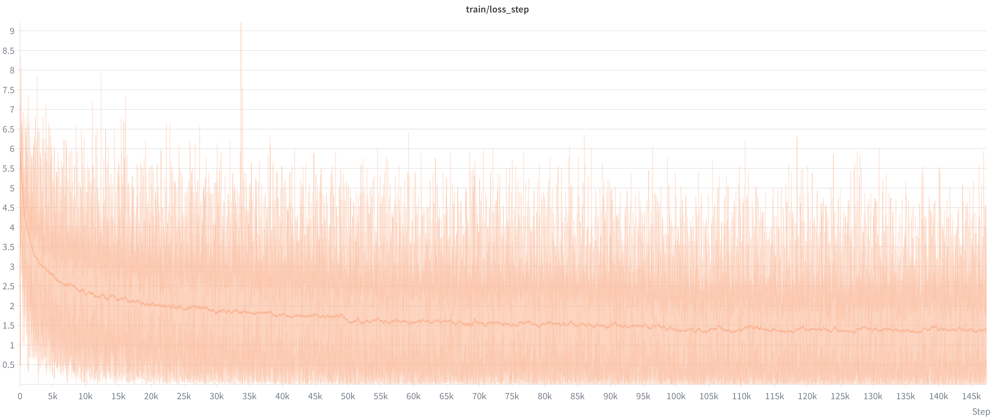
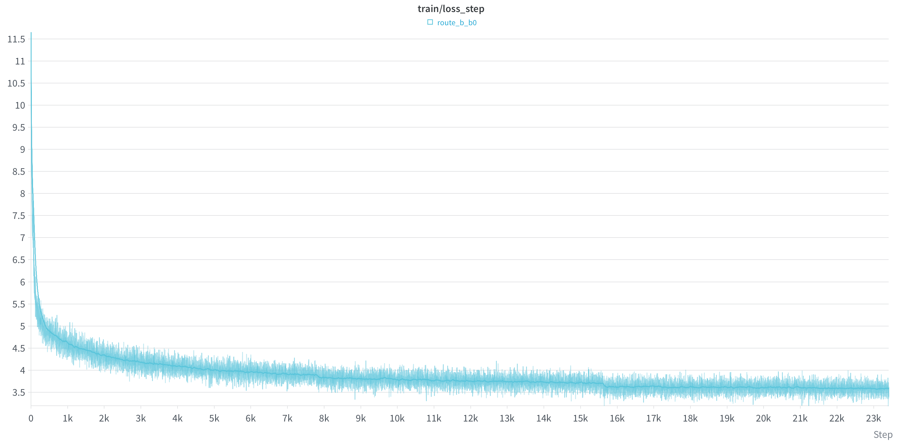
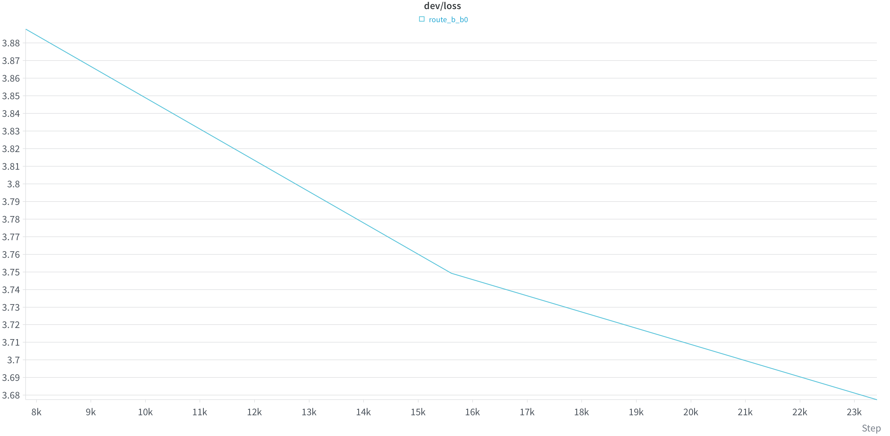

# Speech-MiniMind

> **项目定位**：Speech-to-Speech。给定一段语音输入，系统要"听懂"并用语音回答。这个仓库把目标拆成两条可独立推进的技术路线，最终殊途同归——让机器能听、能想、能说。

从一段 WAV 开始，亲手构建一个中文 Speech LLM：WAV → FFT → Mel → Tiny Conformer + CTC → Speech Projector → Qwen3-0.6B（非思考模式）。

目标：能看懂、能运行、能修改的整套教学流水线。

## 两条实现路线

### 路线 A：通用 LLM 前挂语音编码器 + 后接 TTS（级联式）

```
语音输入 ──► 声学编码器(→ Projector) ──► 通用LLM(Qwen3-0.6B) ──► 文本回答 ──► TTS ──► 语音输出
```

- 先训练**声学编码器**（Tiny Conformer + CTC / Paraformer）把语音变成帧级特征，再接入通用 LLM。
- LLM 负责理解与推理，输出**文本**；文本经**TTS**合成语音回答。
- 优点：复用成熟 LLM 与 TTS，文本能力强、可控性好；缺点是语音信息在"量化到文本"这一步有损，级联误差累积。

### 路线 B：音频专属 LLM（离散 codebook 端到端）

```
语音输入 ──► 量化编码器(codebook) ──► 音频专属LLM(Qwen3-0.6B) ──► 解码器 ──► 语音输出
```

- 语音**直接**经过量化编码器生成**codebook**（离散 token 序列），全程音频时域。
- 由**音频专属的 LLM**（同样是 Qwen3-0.6B）在 token 序列上建模、理解并生成。
- 生成的 codebook 再经**解码器**还原为波形，端到端输出语音。
- 优点：语音信息无文本有损，更接近"听"的本质；缺点是需专用数据与更大的训练成本。

> 两条路线共享同一份**语音理解**基础，可并行演进、互为对照。以下文档先按**路线 A** 搭建教学主线。

```text
00 语音基础 → 01 Mel 频谱 → 02 声学编码器（Tiny Conformer + CTC，含流式版） → 03 接入 Qwen3-0.6B → 04 指令微调语音 LLM
```

分章教学文档见 [`docs/`](docs/)：

| 章节 | 内容 | 文档 |
|---|---|---|
| 00 语音基础 | WAV、波形、FFT、STFT | [docs/00_audio_basics.md](docs/00_audio_basics.md) |
| 01 Mel 频谱 | 功率谱、Mel 滤波器组、log-Mel | [docs/01_mel_spectrogram.md](docs/01_mel_spectrogram.md) |
| 02 声学编码器 | Tiny Conformer、AISHELL-1、CTC；流式 Conformer（因果分块版） | [docs/02_acoustic_encoder.md](docs/02_acoustic_encoder.md) |
| 03 接入 Qwen3-0.6B | Speech Projector、语音前缀 | [docs/03_speech_qwen3.md](docs/03_speech_qwen3.md) |
| 04 指令微调语音 LLM | 合并指令数据、LoRA 微调 Qwen3-0.6B | 见下方第 7/8 节 |
| 05 音频专属 LLM | 离散 codebook、冻结 codec、音频 LM 预训练与语音到语音微调（路线 B） | [docs/05_audio_native_llm.md](docs/05_audio_native_llm.md) |

## 路线 A：级联式 Speech LLM 端到端实现（教学主线）

下面从环境准备到最终微调，把**路线 A** 完整走一遍：编码器 → Projector → 指令微调语音 LLM →（文本回答，可接 TTS 输出语音）。

### 环境安装

```bash
conda create -n speech-llm python=3.11
conda activate speech-llm
python -m pip install -r requirements.txt
```

### 1. 语音分析（00/01）

对示例音频生成波形、频谱、STFT 动画：

```bash
python scripts/analyze_audio.py examples/disgusted_to_happy.wav \
  --plot outputs/example.png --stft-plot outputs/stft.png --stft-gif outputs/stft_process.gif
```

### 2. 数据集

本项目后续训练用到的数据集都统一放在 **ModelScope** 上：编码器用的 manifest、stage-1 转写语料与编码器权重都在主仓库；只有体量最大的 AISHELL-1 **原始音频**因为太大，改用 `scripts/download_aishell1.py` 从 ModelScope 镜像下载。

- 主仓库（AISHELL-1 `processed` manifest/vocab、stage-1 转写语料、编码器权重）：<https://www.modelscope.cn/models/ghjghj1017/Tiny_Conformer>

```bash
python -m pip install modelscope

# 1) 声学编码器（02）用的 manifest 与字符词表：下载主仓库，再把 processed.tar.gz 解压到 data/aishell1/
python -c "from modelscope.hub.snapshot_download import snapshot_download; snapshot_download('ghjghj1017/Tiny_Conformer', local_dir='outputs/Tiny_Conformer')"
mkdir -p data/aishell1
tar -xzf outputs/Tiny_Conformer/processed.tar.gz -C data/aishell1

# 2) AISHELL-1 原始音频（约 15G，支持断点续传），下载并解压到 data/aishell1/data_aishell/
python scripts/download_aishell1.py
```

主仓库里跟 AISHELL-1 有关的两份数据分工如下（**都只是"整理好的文档"，不含任何音频字节**）：

- **`processed.tar.gz`**：解压后是 `data/aishell1/processed/{train,dev,test}.csv`（表头 `path,text`）与 `vocab.txt`，供第 3/4 节的声学编码器训练与评估使用。CSV 的 `path` 指向 `data/aishell1/data_aishell/wav/...`。
- **`aishell-1/aishell-1-{train,dev,test}.parquet`**：第 5 节 Projector 用的 stage-1 转写语料，六列（`wav` / `prompt` / `answer` / `source` / `task` / `lang`），`wav` 同样指向 `data/aishell1/data_aishell/wav/...`。

下载后按第 2.2 节的目录布局把数据放到 `data/` 下，训练脚本即从这些路径读取。

#### 2.1 数据集组成

**stage 1** —— 只含 AISHELL-1，指令固定为「请转写为中文」，答案就是转写文本。按 AISHELL-1 **官方划分**拆成 `train` / `dev` / `test`，训练时不再切分。声学编码器（第 3/4 节）读 `data/aishell1/processed/` 的 CSV，Speech Projector（第 5 节）读 `data/speech2text_corpus/stage1_aishell/` 的 JSONL；两者记录的是同一批音频，只是格式不同。

| 划分 | 行数 | 用途 |
|---|---:|---|
| train | 120098 | 第 3/4 节声学编码器（`processed/train.csv`）、第 5 节 Speech Projector（`stage1_aishell/train.jsonl`） |
| dev | 14326 | 编码器开发集；Projector 与 test 合并为验证集 |
| test | 7176 | 编码器测试集；Projector 与 dev 合并为验证集 |

**stage 2** —— AISHELL-1 之外的全部自然问答 / 指令数据，统一为同一行格式，用于第 8 节指令微调 Speech LLM。每行仍带 `prompt`，但**训练第 8 节时只读取 `wav` 与 `answer`**（`prompt` 供 TTS 合成问题音频用，不再作为文本输入），统一配固定系统提示词「你是一个语音助手，根据用户的音频内容回答用户的问题」。由以下来源筛选、去重、统一格式后合成：

| 来源 | 保留内容 | 语言 | 音频 |
|---|---|---|---|
| COIG 人类价值观 | instruction/output 问答 | zh | 文本，需 TTS |
| Firefly OpenQA + Dictionary | 开放问答、词典解释 | zh | 文本，需 TTS |
| COIG-CQIA | 仅高质量子集 | zh | 文本，需 TTS |
| COIG 翻译指令 | 仅高质量中文子集 | zh | 文本，需 TTS |
| moss_speech_qa | 仅首轮问答 | zh | 已合成音频 |
| VoiceAssistant-400K | 全部保留 | en | 原始音频 |

#### 2.2 本地目录布局

下载后把数据放到 `data/` 下，训练脚本按下列路径读取：

```text
data/
├── aishell1/
│   ├── data_aishell/            # 原始音频（wav/、transcript/、resource_aishell/），download_aishell1.py 下载
│   └── processed/               # 第 3/4 节编码器读取，来自 ModelScope 的 processed.tar.gz
│       ├── train.csv            # 表头 path,text
│       ├── dev.csv
│       ├── test.csv
│       └── vocab.txt            # 字符词表，首行 <blank>，其后每行一个汉字
└── speech2text_corpus/
    ├── stage1_aishell/          # 第 5 节 Projector 读取，由 aishell-1/*.parquet 转出
    │   ├── train.jsonl          # AISHELL-1 官方 train 划分
    │   ├── dev.jsonl
    │   └── test.jsonl
    └── splits/                  # 第 8 节 Speech LLM 读取（stage 2，按来源分层切分）
        ├── train.jsonl
        ├── val.jsonl
        └── test.jsonl
```

### 3. 训练中文声学编码器（02，Tiny Conformer + CTC）

#### 非流式（离线整句识别）

```bash
CUDA_VISIBLE_DEVICES=0,1,2,3 torchrun --nproc_per_node=4 trainer/train_conformer_ctc.py \
  --data data/aishell1/processed --epochs 20 --batch-size 32 --lr 2e-4
```

输出到 `outputs/02_acoustic_encoder/`：`metrics.csv`、`loss_curve.png`、逐 epoch checkpoint、`tiny_conformer_ctc.pt`。

#### 流式（chunk-based 因果版）

同一编码器任务的流式实现，用于边听边出的实时场景：

+ **模型**：`model/conformer_streaming.py`（因果下采样、因果卷积、分块因果注意力 + 左上下文缓存）、`model/ctc_streaming.py`（流式 CTC 封装）
+ **训练**：

```bash
CUDA_VISIBLE_DEVICES=0,1,2,3 torchrun --nproc_per_node=4 trainer/train_conformer_streaming_ctc.py \
  --data data/aishell1/processed --epochs 20 --batch-size 32 --lr 2e-4 \
  --chunk-size 32 --left-context 16
```


训练过程（AISHELL-1，约 37k step）的 CTC loss 曲线：

| train/ctc_loss_step | dev/ctc_loss |
|---|---|
|  |  |

train loss 从约 7 收敛到约 0.5；dev loss 从约 3.0 稳定下降到约 0.9。

### 4. 评估声学编码器（02）

```bash
# 一键报告：dev/test CER、checkpoint 对比、样例、RTF
python scripts/evaluate_conformer_report.py \
  --data data/aishell1/processed --output outputs/02_acoustic_encoder --split both

# 单 checkpoint 评估
python scripts/evaluate_conformer_ctc.py \
  --data data/aishell1/processed \
  --checkpoint outputs/02_acoustic_encoder/checkpoint_epoch_020.pt --split dev
```

同目录还有 `scripts/plot_training_metrics.py` 可绘制训练曲线。

### WebUI 流式 vs 非流式演示

运行 `scripts/visualize_asr_webui.py`（Gradio）可视化 02 章声学编码器，左右对比非流式（整句）与流式（增量）识别效果：

```bash
python -m pip install gradio   # 首次需要

python scripts/visualize_asr_webui.py \
  --checkpoint outputs/02_acoustic_encoder/tiny_conformer_ctc.pt \
  --stream-checkpoint outputs/02_streaming_acoustic_encoder/tiny_streaming_conformer_ctc.pt \
  --audio path/to/long.wav
```

> 两侧模型 checkpoints **不可互换**（下采样与卷积结构不同）：非流式用 `outputs/02_acoustic_encoder/` 训练的权重，流式侧需显式传入 `--stream-checkpoint` 才会启用。只演示一侧时省略对应参数即可（`pip install gradio` 首次安装）。启动后访问 `http://0.0.0.0:7860`。


> **关于本套编码器的泛化性声明**：我们的 Tiny Conformer + CTC 编码器只在**中文 AISHELL-1**（16kHz 平稳播音、整句 2–6s）上训练，且**模型参数量较小**（约 Tiny 规模），因此对**训练分布外的输入难以有较好的泛化性能**——例如带口音/方言、语速异常、嘈杂或更长的音频，识别效果会明显下降甚至出现乱码。这属于预期行为，并非代码 bug；如果你需要更通用、更强的声学编码，**建议用开源的成熟编码器**（如 FunASR 的 Paraformer-zh-streaming、Whisper/OpenAI、语音自监督前端 wav2vec 2.0 / HuBERT 等）来达到更好的效果，本项目的编码器更多用于教学演示与完整流水线打通。

我们训练好的 02 章「Tiny Conformer + CTC」编码器权重（**流式**与**非流式**）会发布在 ModelScope 仓库：<https://www.modelscope.cn/models/ghjghj1017/Tiny_Conformer>。你可以直接下载使用，省去本地重新训练。

### 换用成熟开源编码器（推荐 FunASR / SenseVoice-Small）

如果后续要换成开源的成熟声学编码器，**推荐用 FunASR 的 SenseVoice-Small**。它是离线非自回归模型，适合批量提取帧级 encoder hidden states。首次使用时安装依赖并下载模型：

```bash
python -m pip install funasr modelscope

# 默认可由 FunASR 自动下载；也可提前下载到本地目录
python -c "from modelscope.hub.snapshot_download import snapshot_download; snapshot_download('iic/SenseVoiceSmall', local_dir='outputs/sensevoice-small')"
```

### 5. 训练语音投影器连接 Qwen3-0.6B（03，Speech Projector）

使用 **SenseVoice-Small 作为冻结编码器**。`train_speech_projector.py` 读第 2 节下载的 stage-1 目录 `data/speech2text_corpus/stage1_aishell/`（内含 `train.jsonl` / `dev.jsonl` / `test.jsonl`，每行 `{"wav": "...", "prompt": "请转写为中文", "answer": "..."}`），因此先确认第 2 节的数据集已放好，再准备 [Qwen3-0.6B](https://huggingface.co/Qwen/Qwen3-0.6B) 权重（本项目在 95 上放在 `/gpu3/guhj/models/Qwen3-0.6B`）：

```bash
CUDA_VISIBLE_DEVICES=0,1,2,3 torchrun --nproc_per_node=4 trainer/train_speech_projector.py \
  --data data/speech2text_corpus/stage1_aishell \
  --encoder-type sensevoice \
  --sensevoice-model outputs/sensevoice-small \
  --qwen3-model /gpu3/guhj/models/Qwen3-0.6B \
  --output outputs/03_speech_qwen3_projector --epochs 5 --batch-size 2 \
  --lr-schedule cosine --warmup-ratio 0.03 --min-lr-ratio 0.1 --loss-ema 0.02 \
  --wandb --wandb-name projector_qwen3_sensevoice
```

语音两侧的 `<|audio_start|>` / `<|audio_end|>` 在 Qwen3 的 tokenizer 里**并不存在**——直接 tokenize 会被拆成 6 个互不相关的字节 token，因此由 `model/chat_format.py` 追加为 added special token：在 Qwen3-0.6B 上落在 151669/151670/151671，仍在 embedding 表的 151936 行之内，**无需扩表**。路线 B（`model/audio_lm.py`）复用同一对，两条路线对「音频在此」的信号因此一致。无论用哪个编码器后端，都冻结编码器和 Qwen3，只训练约 2.4M 参数的 `SpeechProjector`（输出维度对齐 Qwen3-0.6B 的 1024）。

> Qwen3-0.6B 的 hidden size 是 **1024**，而 MiniMind-3 是 768，两者的 projector 形状不同：**旧的 `projector_epoch_*.pt` 不能复用**，必须按本节重训。同理，此前用 MiniMind 训出的 03/04 章 checkpoint 与新的 Qwen3 backbone 不兼容。

训练过程（AISHELL-1，约 9.5k step）的 loss 曲线：

| train/loss_step | dev/loss |
|---|---|
|  |  |

train loss 从约 8.5 收敛到约 0.5；dev loss 从约 0.96 稳定下降到约 0.64。

> 每步记三个 key：`train/loss_step` 是**所有 rank** 的 batch 上的跨卡、按监督 token 加权平均（不是 rank 0 的 `--batch-size` 条），`train/loss_ema` 用 `--loss-ema`（默认 0.02）在它之上做指数平滑，`train/lr` 是当前学习率。学习率默认走 `--lr-schedule cosine`：前 `--warmup-ratio`（默认 0.03）线性 warmup，之后 cosine 衰减到 `--min-lr-ratio`（默认 0.1）倍（`1e-4 → 1e-5`）；`--lr-schedule none` 还原恒定 lr。这三个 key 与路线 A 第 8 节、路线 B 的 B0/B1 两个 trainer 完全一致（都在 `main` 里按**全部训练步数**算 warmup 长度）。

### 6. 统一 stage 2 音频采样率（`resample_stage2_mixed.py`）

第 2 节下载的 stage 2 切分音频采样率仍不一致（moss_speech_qa 与合成语音的 Qwen3-TTS=24kHz、VoiceAssistant-400K=22050Hz，AISHELL-1=16kHz），而 `train_speech_qwen3.py` 强制 16kHz 输入。用 `resample_stage2_mixed.py` 统一到 16kHz：

```bash
# 第 2 节下载的 stage 2 三份清单
python scripts/resample_stage2_mixed.py --data data/speech2text_corpus/splits --splits train,val,test --sr 16000
```

### 8. 指令微调语音 LLM（04，真正的 Speech-MiniMind）

在第 5 节的 Projector 桥接基础上，**微调整个 Qwen3-0.6B**（LoRA 或全参），并以较小学习率同步训练 Projector，让它变成能听语音、生成回答的完整 Speech LLM。

> 0.6B 全参微调对学习率比 64M 模型敏感得多：`--tune full` 建议用脚本默认的 `--lr 2e-5`，`--tune lora` 用默认的 `--lr 2e-4`。LoRA 覆盖不到 `embed_tokens`，两个 audio marker 的 embedding 行会一直保持初始化值；需要它们一起学就用 `--tune full`。

数据侧把第 2 节下载的 stage 2 切分和第 6 节的重采样做完即可：

```bash
# Projector 与 Qwen3 一起训练；--projector-lr 是 Projector 的独立小学习率
CUDA_VISIBLE_DEVICES=0,1,2,3 torchrun --nproc_per_node=4 trainer/train_speech_qwen3.py \
  --data data/speech2text_corpus/splits \
  --encoder-type sensevoice --sensevoice-model outputs/sensevoice-small \
  --projector-checkpoint outputs/03_speech_qwen3_projector/projector_epoch_005.pt \
  --qwen3-model /gpu3/guhj/models/Qwen3-0.6B \
  --output outputs/04_speech_qwen3_sft --epochs 3 --batch-size 2 \
  --tune full --tune-projector --projector-lr 5e-5 \
  --lr-schedule cosine --warmup-ratio 0.03 --min-lr-ratio 0.1 --loss-ema 0.02 \
  --wandb --wandb-name speech_qwen3_sft
```

> 命令假定 `speech-llm` 环境已激活（否则 `torchrun` 会落到 anaconda 的 python 上、报 `ModuleNotFoundError: No module named 'funasr'`）；未激活时把 `torchrun` 换成 `/gpu3/guhj/envs/speech-llm/bin/python -m torch.distributed.run` 即可。

训练过程（stage 2 中文切分 91,490 行，4 卡约 5.7k step/epoch）的 loss 曲线：

| train/loss_step（跨卡平均） | dev/loss |
|---|---|
|  |  |

train loss 从约 8 收敛到约 0.85；dev loss 稳定下降到约 0.58。

每步会记三个 key：`train/loss_step` 是**所有 rank** 的 batch 上的跨卡平均（4 卡 × `--batch-size 4` 即 16 条样本，而不是 rank 0 的 4 条），`train/loss_ema` 用 `--loss-ema`（默认 0.02，半衰期约 35 步、等效窗口约 50 步）在它之上做指数平滑，`train/lr` 是当前学习率。**看趋势只看 `train/loss_ema`**：单批样本自身的 loss 波动很大——stage 2 语料逐条约 2.2~9.8，且与答案长度强反相关（8~40 字的短答案 6.8~9.8，185~396 字的长答案 2.2~3.9）；按 σ≈1.42 推算，4 条一批的均值标准差约 0.7、16 条约 0.36。所以几百步内均值横走通常只是监控噪声，只有平滑后仍然横走/上扬，或 grad norm 飙升、出现 NaN，才需要停下来看。

学习率默认走 `--lr-schedule cosine`：前 `--warmup-ratio`（默认 0.03）线性 warmup，之后 cosine 衰减到 `--min-lr-ratio`（默认 0.1）倍，两个参数组按同一比例缩放（`--lr 2e-5`、`--projector-lr 5e-5` → 最终 2e-6 / 5e-6）。warmup 长度按**全部训练步数**（`--epochs` × 每 epoch 步数）算：4 卡 × `--batch-size 4` × 2 epoch ≈ 11.4k 步 → warmup 约 343 步。要还原恒定 lr 就用 `--lr-schedule none`。

### 9. 评估与测试指令微调模型（离线指标 / 推理 / WebUI）

第 8 节只记录 `dev_loss`，它衡量文本 token 的 teacher-forcing 交叉熵，**不能替代生成质量评估**。例如同一批音频里既有短问答也有长解释，平均 loss 会把「回答准确」和「内容失配」混成一个数。

另外注意，第 8 节用固定系统提示词「你是一个语音助手，根据用户的音频内容回答用户的问题」训练，**推理与评测必须使用同一个提示词**（`infer_speech_qwen3.py` / `evaluate_speech_qwen3.py` 的默认值即为此），否则 prompt 与训练不一致，生成质量会明显下降。

第 8 节还会在 `--tune-projector` 时把 Projector 与 LLM 一起微调。因此推理时必须使用同一阶段的 projector：`outputs/04_speech_qwen3_sft/projector_epoch_XXX.pt`，而不是旧的 `outputs/03_speech_qwen3_projector/projector_epoch_005.pt`。混用阶段会让转写也明显变差。

仓库提供三个入口：离线评测（`evaluate_speech_qwen3.py`）、单条 CLI 推理（`infer_speech_qwen3.py`）和网页互动平台（`visualize_speech_qwen3_webui.py`）。三者复用同一套推理管线：

```text
WAV ──▶ frozen 声学编码器(sensevoice/conformer/paraformer) ──▶ SpeechProjector(冻结)
        ──▶ 语音前缀 embeddings ⊕ 指令文本 tokens ──▶ Qwen3-0.6B(微调后) ──▶ 回答文本
```

#### 问答示例

| # | 问题 | speech-minimind |
| --- | --- | --- |
| 1 | 简述商业秘密的构成要件 | “商业秘密的构成要件包括：(1)权利主体是自然人或法人。(2)权利客体是商业秘密。(3)权利内容是商业秘密的保密性。(4)权利内容具有排他性。(5)权利内容具有独占性。(6)权利内容具有时间上的限制性。(7)权利内容具有排他性。” |
| 2 | 好莱坞选择东方文化背景时，为什么更偏重日本？ | “因为日本的建筑风格和中国建筑风格不一样，所以中国建筑风格的元素在日式建筑中会显得更加突出。” |
| 3 | “目不知书”的含义是什么？ | “指不识字。 成语出处：无” |

#### 离线生成评估

`evaluate_speech_qwen3.py` 逐条生成答案，并按 `source / task / lang` 分层输出 exact match 与字符级（中文）或词级（英文）错误率。它读的是 stage 2 的行（`wav` + `answer`；每行没有 `instruction` 时自动回落到固定系统提示词），先用小型分层抽样确认配置，再跑到完整 dev：

```bash
# 全量 val split（生成式评估较慢；确认配置后再跑）
python scripts/evaluate_speech_qwen3.py \
  --data data/speech2text_corpus/splits/val.jsonl \
  --encoder-type sensevoice --sensevoice-model outputs/sensevoice-small \
  --projector-checkpoint outputs/04_speech_qwen3_sft/projector_epoch_003.pt \
  --qwen3-model outputs/04_speech_qwen3_sft/model_epoch_003 \
  --output outputs/04_speech_qwen3_sft/eval_stage2_full
```

输出 `predictions.csv`（逐条音频/提示词/参考/生成/错误率）、`group_metrics.csv`（按来源、任务、语言）和 `report.json`（总指标与配置）。别只看总错误率：长答案问答会淹没短问答的错误；至少要同时看 `moss_speech_qa`、`coig_*` / `firefly_*`、`voiceassistant_400k` 几组。

#### CLI 推理

```bash
# full 全参微调模型 + SenseVoice 前端；projector 必须来自 04 阶段
python scripts/infer_speech_qwen3.py \
  --audio path/to/utterance.wav \
  --encoder-type sensevoice \
  --sensevoice-model outputs/sensevoice-small \
  --projector-checkpoint outputs/04_speech_qwen3_sft/projector_epoch_003.pt \
  --qwen3-model outputs/04_speech_qwen3_sft/model_epoch_003
```

#### WebUI 互动平台（FastAPI + WebSocket，双模式）

```bash
python -m pip install fastapi uvicorn soundfile qwen-tts   # 首次需要

# 局域网访问 + 麦克风 + Qwen3 文本回答转语音
python scripts/visualize_speech_qwen3_webui.py \
  --encoder-type sensevoice \
  --sensevoice-model outputs/sensevoice-small \
  --projector-checkpoint outputs/04_speech_qwen3_sft/projector_epoch_003.pt \
  --qwen3-model outputs/04_speech_qwen3_sft/model_epoch_003 \
  --instruction "你是一个语音助手，根据用户的音频内容回答用户的问题" \
  --tts-model /gpu3/guhj/models/Qwen3-TTS-12Hz-1.7B-CustomVoice \
  --tts-speaker Serena \
  --host 0.0.0.0 --port 7861 --ssl-auto
```

实际运行效果（上传一段语音，模型转写为中文文本）：


> 本机（Mac/CPU）只会把 `outputs/` 留空、不做对待训练——测试平台需要真实 checkpoint 与 GPU。把上面命令在**训练过该模型的 GPU 机器**上执行即可，所有权重都从你传入的路径加载，仓库不额外下载任何东西。

## 路线 B：音频专属 LLM（离散 codebook 端到端）

路线 A 把语音变成**连续**向量再交给通用 LLM，输出**文本**；路线 B 则把语音量化成**离散 codebook token**，让 LLM 直接在 token 序列上建模并生成，再由解码器还原波形：

```text
WAV ──► 冻结 codec 编码器 ──► 离散 audio tokens ──► 音频专属 LLM（Qwen3-0.6B）
                                                    │
                              WAV ◄── 冻结 codec 解码器 ◄── 生成的 audio tokens
```

与路线 A 的三点关键差异：

- **必须扩词表**：把 `codebook_size × num_codebooks` 个音频 token 追加到 Qwen3 的文本词表之后（`ensure_audio_tokens` 之后 text vocab = 151672），再训练 `embed_tokens` / `lm_head` 的新增行（LoRA 覆盖不到，因此路线 B 默认 `--tune full`）。
- **输入输出同为离散 token**：序列是 `[BOS] <|audio_start|> 输入语音 <|audio_end|> <|audio_start|> 输出语音 <|audio_end|> [EOS]`，损失只算输出语音段。
- **不复用路线 A 的连续前缀**：两条路线共享数据与训练骨架，但序列布局独立。

完整教学文档见 [docs/05_audio_native_llm.md](docs/05_audio_native_llm.md)。

### 1. 确认 codec 重建质量（05，M0 闸门）

路线 B 的第一道闸门：冻结 codec 必须能把中文语音编成离散 token 再还原回「人能听懂」的波形，否则后面的音频 LM 训练没有意义。

```bash
python scripts/eval_codec_reconstruction.py \
  --data data/aishell1/processed --split dev --num 20 \
  --codec-type mimi --device cuda:0 --output outputs/05_route_b_codec_check
```

输出重建失真 / STOI / PESQ / 往返 ASR CER 到 `outputs/05_route_b_codec_check/`。

`--data` 支持三种输入，中英文与「回答音频域」都能用同一条命令跑：AISHELL 风格目录（读 `{split}.csv` 的 `path`/`text`）、项目 JSONL 清单（读 `audio` + 文本参照，或读 `answer_codes` + `answer_text`）、或直接指定单个清单文件。用 `--asr-language` 指定识别语言，评分单位随之从字符级 CER 切换为词级 WER：

```bash
# 英文数据集：重建 + 识别质量（WER）
python scripts/eval_codec_reconstruction.py \
  --data data/voiceassistant400k_50k --split dev --num 20 \
  --asr-language en --codec-type mimi --device cuda:0 \
  --output outputs/05_route_b_codec_check_en

# sft_a2a 回答音频域：只有 code 没有波形，直接解码后算往返错误率（zh/en 都行）
python scripts/eval_codec_reconstruction.py \
  --data data/route_b/s2s --split dev --num 50 \
  --asr-language en --codec-type mimi --device cuda:0 \
  --output outputs/05_route_b_codec_check_s2s_en
```

#### 实测结果（Mimi 8×2048，全量 dev 集）

`--num 0` 表示不抽样、评整个 split。以下为在 95 上用 `--codec-type mimi` 跑完全量 dev 的结果：

| 数据集 | 语言 / 评分单位 | 样本数 | `mel_mae` | 错误率 | `tokens_per_s` |
|---|---|---|---|---|---|
| `data/aishell1/processed`（dev） | zh / 字符级 CER | 14,326 | 2.5791 | **0.1498** | 12.6171 |
| `data/voiceassistant400k_50k`（dev） | en / 词级 WER | 2,500 | **1.8593** | **0.1659** | 12.6545 |

读法：**英文的重建失真更低**（`mel_mae` 1.86 vs 2.58），但中文的识别错误率反而更好（CER 0.150 < WER 0.166）——两者单位不同（字符 vs 词），不能直接比大小，只能各自与自己的阈值比。两边的 `tokens_per_s` 都稳定在 12.6，与 Mimi 的 12.5 Hz 标称帧率吻合，说明编解码长度对齐没有偏差。结论：**冻结 Mimi 8 码本在中英文上都可用，M0 闸门通过，无需切换 codec。**

### 2. 构建语音到语音数据（05）

优先用 MiniMind-O 已经 token 化好的 `sft_a2a`（`--download` 会从 ModelScope 拉取）：

```bash
python scripts/prepare_speech_to_speech.py --download \
  --file-name sft_a2a.parquet --lang zh \
  --output data/route_b/s2s --device cuda:0
```

输出 `data/route_b/s2s/{train,dev}.jsonl` + `codes/` 缓存。

> 完整 `sft_a2a.parquet` 有 414024 行 / 5.7 GB，中文占约 34.65% 且偏向文件后段，用 `--limit` 抽小样本时可能一条中文都取不到（统计里会显示 `kept: 0`）；冒烟请用 `--file-name sft_a2a_mini.parquet`，或把 `--limit` 调大。读取按 row group 流式进行。

### 3. 构建纯音频语料与 token 缓存（05，可选 B0 前置）

B0 只需要「一串串音频」，不需要问答配对。这一步把散落在各数据集里的音频汇总成一份清单，再用冻结 codec **一次性**编码成 `.npy` 离散 token——codec 编码比一次 LLM step 还贵，放进训练循环里每个 epoch 重跑是不可接受的，所以全部离线缓存。

#### 3.1 纯音频清单

95 上当前 B0 使用 `/gpu3/guhj/data/` 下的 Emilia 中英文音频，已整理到 `data/route_b/audio_lm_emilia/{train,dev,test}.jsonl`。全量保留中文 133,928 条、英文 77,667 条；按元数据时长，中文/英文约为 60.4%/39.6%。每种语言内部按时长近似划分 train/dev/test = 98%/1%/1%，按 `(lang, speaker)` 分组隔离，随机种子为 42。具体统计见该目录的 `metadata.json`。

下面是旧语料的可选整理方式，**不是 Emilia 清单的生成命令**：

```bash
python scripts/prepare_audio_lm_corpus.py --data-root data --output data/route_b/audio_lm
```

脚本读取三类已有数据，只取其中的音频路径，输出 `data/route_b/audio_lm/{train,dev}.jsonl`：

| 来源 | 读什么 | 语言 | 采样率 |
|---|---|---|---|
| AISHELL-1 | `data/aishell1/processed/{train,dev}.csv` 的 `path` 列 | zh | 16 kHz |
| moss_speech_qa | `data/moss_speech_qa/{train,dev}.jsonl` 的 `audio`（问题是 Qwen3-TTS 合成音） | zh | 24 kHz |
| voiceassistant400k_50k | 同上的 `audio`，**默认不引入**，需加 `--include-english` | en | 22.05 kHz |

#### 3.2 编码成离散 token 缓存（`cache_audio_tokens.py`）

将 `MIMI_MODEL` 替换为本地 Mimi 模型目录（包含 `config.json` 和权重），避免默认访问 Hugging Face：

```bash
MIMI_MODEL=/实际的/Mimi模型目录
HF_HUB_OFFLINE=1 TRANSFORMERS_OFFLINE=1 \
/gpu3/guhj/envs/speech-llm/bin/python scripts/cache_audio_tokens.py \
  --data data/route_b/audio_lm_emilia \
  --output data/route_b/audio_lm_emilia_codes \
  --codec-type mimi --codec-model "$MIMI_MODEL" \
  --device cuda:0 --batch-size 16
```

目录模式只编码 `train.jsonl` 和 `dev.jsonl`，不会编码 `test.jsonl`；这不影响 B0 训练。Mimi 只在编码阶段加载，B0 训练直接读取 token 缓存。

脚本按 manifest 逐条读音频 → 按 batch 送进冻结 Mimi → 每条存一个 `.npy`，并把清单重写成指向缓存的版本：

```text
data/route_b/audio_lm_emilia_codes/
├── codes/train/0000000.npy      # 每条音频一个 shard，int16，形状 (Q=8, T)
├── codes/dev/0000000.npy
├── train.jsonl                  # 重写后的清单：{"codes": "codes/train/0000000.npy", ...}
├── dev.jsonl
└── metadata.json                # codec 类型 / num_codebooks / codebook_size / sr / frame_rate
```

### 4. B0 音频 LM 预训练（05，可选）

在纯音频语料上先学 codec token 的分布，再用它初始化第 5 节：

```bash
CUDA_VISIBLE_DEVICES=6,7 \
/gpu3/guhj/envs/speech-llm/bin/python -m torch.distributed.run \
  --nproc_per_node=2 --master-port=29521 \
  trainer/train_audio_lm_pretrain.py \
  --data data/route_b/audio_lm_emilia_codes \
  --qwen3-model /gpu3/guhj/models/Qwen3-0.6B \
  --output outputs/05_route_b_audio_lm_emilia \
  --epochs 3 --batch-size 8 \
  --tune full --num-workers 4 \
  --wandb --wandb-name route_b_b0_emilia
```

运行前需完成上一节的 train/dev 编码，并确认 GPU 6/7 和端口 29521 可用。`--batch-size 8` 尚未在这批 Emilia 音频上验证显存占用；长音频可加 `--grad-checkpointing` 或降低 batch size。新输出目录独立于旧 B0 checkpoint。

> 换成 Qwen3-0.6B 后 text vocab 从 6400 变成 151672、hidden 从 768 变成 1024，因此**旧的 B0 checkpoint（`outputs/05_route_b_audio_lm/model_epoch_003`）与新的 backbone 不兼容**，需要按本节重跑 B0，再进入第 5 节。

历史 B0 训练过程（非本次 Emilia 训练，约 23k step）的 loss 曲线：

| train/loss_step | dev/loss |
|---|---|
|  |  |

train loss 从约 8.5 快速降到约 4.5（约 1k step 内），之后缓慢收敛到约 3.6；dev loss 从约 3.88 稳定降到约 3.68。

> 与路线 A 的 03/04 一致：每步记跨卡（按监督 token 加权）的 `train/loss_step`、平滑后的 `train/loss_ema`（`--loss-ema` 默认 0.02）和 `train/lr`；学习率默认 warmup 3% 后 cosine 衰减到 10%（`2e-4 → 2e-5`），`--lr-schedule none` 可还原恒定 lr；loss 同样走 `model/chunked_loss.py`（显存说明见下一节，长音频 batch 可加 `--grad-checkpointing`）。

### 5. 语音到语音指令微调（06，B1/B2）

只监督回答语音段（prompt / 输入音频 / padding 全部 `-100`）：

```bash
CUDA_VISIBLE_DEVICES=6,7 torchrun --nproc_per_node=2 \
  trainer/train_speech_to_speech.py \
  --data data/route_b/s2s \
  --init-from outputs/05_route_b_audio_lm_emilia/model_epoch_003 \
  --output outputs/06_route_b_s2s --epochs 3 --batch-size 2 \
  --tune full --num-workers 4 --grad-checkpointing \
  --lr-schedule cosine --warmup-ratio 0.03 --min-lr-ratio 0.1 --loss-ema 0.02 \
  --wandb --wandb-name route_b_s2s
```

> 与第 8 节同理：每步记 `train/loss_step`（跨卡、按监督 token 加权的均值，不是 rank 0 的 4 条）、`train/loss_ema` 与 `train/lr`，学习率默认 warmup 3% 后 cosine 衰减到 10%（`1e-4 → 1e-5`）；`--lr-schedule none` 可还原恒定 lr。B1 的数据增强开关是 `--code-dropout`，默认 0（不增强）。`torchrun` 同样需要 `speech-llm` 已激活，否则换成 `/gpu3/guhj/envs/speech-llm/bin/python -m torch.distributed.run`。

> **显存：`--loss-chunk` 与 `--grad-checkpointing`。** 路线 B 的输出词表是 151672（text）+ 8×2048（audio）= **168056 行**，而 `--max-length` 默认由帧上限推出：`(max_prompt_frames + max_answer_frames) × num_codebooks + 16 = (256+256)×8+16 = 4112` token/条，所以 `--batch-size 2` 最多就是 8224 token/卡。实测这份 s2s 清单（323,920 行，前 3000 行统计）的序列长度：p50=2224、p75=2416、p90=2648、p95=2864、p99=3352、最长 4112 token——**批内长度取最长样本**，所以 bs=2 的典型长度在 2400 上下。
>
> 旧实现一次性把整条序列过 LM head：fp32 下 `(B, L, 168056)` 约 5.2 GiB，加上 `view(-1, vocab)` 触发的 `.contiguous()` 副本、`log_softmax` 的输出及其梯度一共 4 份 ≈ 21 GiB（L=4112、bs=2），是当时单笔最大的可省开销。现在 loss 统一走 `model/chunked_loss.py`：LM head 每次只算 `--loss-chunk`（默认 256）个位置并在反向重算，实测 loss 与梯度与旧路径完全一致（`delta<5e-7`，梯度逐元素最大差 `5e-8`，不同 chunk 大小结果相同），那份 21 GiB 降到几百 MB。同时默认设 `PYTORCH_ALLOC_CONF=expandable_segments:True` 消除碎片（环境里已有该变量则以你的设置为准）。
>
> 但长序列上 bs=2 的瓶颈**不在 loss 而在 decoder**：fp32 权重下 SDPA 没有 flash kernel（flash-attn 只支持 fp16/bf16），`(B, heads, L, L)` 的注意力分数必须留给反向，按 L² 增长——bs=2 时每层约 2 GiB、28 层约 56 GiB。实测（bs=2、chunked loss、不含 AdamW 状态、A800-80GB）peak allocated：L=1024 → 15.7 GiB、L=2048 → 34.5 GiB、L=3072 → 60.4 GiB、L=4112 → **仍 OOM**（已到 77.6 GiB）；把 math backend 关掉只会 `RuntimeError: Invalid backend`，所以 fp32 下躲不开这一项。因此在默认帧上限（256/256）下 bs=2 必须加 `--grad-checkpointing`（逐层重算；实测 bs=2 × 4112 token 能跑完一个 epoch，5.4 s/step，不加则同一形状 OOM），或把 `--max-prompt-frames/--max-answer-frames` 降到各自 192 以下；只跑典型长度（≤2900 token，覆盖 p99）时 bs=2 不加也能过（实测 4 步 1.96 s/step）。`--grad-checkpointing` 用非重入式 checkpoint（`use_reentrant=False`），与 DDP、chunked loss 都会一并生效。

不跑 B0 时可去掉 `--init-from`，直接用 Qwen3-0.6B 权重冷启动（此时 audio token 行与两个 marker 行都是新初始化的，收敛会更慢）。

### 6. 端到端推理（06）

```bash
python scripts/infer_speech_to_speech.py \
  --audio examples/disgusted_to_happy.wav \
  --model outputs/06_route_b_s2s/model_epoch_003 \
  --codec-type mimi --device cuda:0 --output outputs/route_b_answer.wav
```

> codec 为冻结的预训练模型（Mimi 8×2048、12.5 Hz、24 kHz；EnCodec 24 kHz 作对照），仓库不训练 codec。第一阶段的 s2s 数据主要来自 MiniMind-O `sft_a2a` 与自建 TTS 合成配对，**音色单一、无真实噪声**，属于教学闭环的已知局限，不能当作真实场景泛化结论。


## 目录结构

```text
Speech-MiniMind/
├── docs/        # 分章教学文档
├── assets/      # README 插图（训练曲线等）
├── examples/    # 示例音频
├── model/       # Conformer、CTC、流式版、Projector、Qwen3 适配（qwen3_adapter.py）、chat 模板（chat_format.py）、音频 codec / 音频 LM（路线 B）
├── dataset/     # Dataset 与训练时随机音频增强（含路线 B 的 token 数据集）
├── trainer/     # 各阶段训练脚本
├── scripts/     # 数据准备 / 下载 / 评估 / 推理 / WebUI
├── data/        # 本地数据，不提交
├── outputs/     # 图表、日志、checkpoint，不提交
├── requirements.txt
└── README.md
```

## 开源说明

数据集遵循 AISHELL-1 原始许可；`data/`、`outputs/`、`.pt`、压缩包不提交仓库。正式发布前会补充代码许可证与数据集引用。