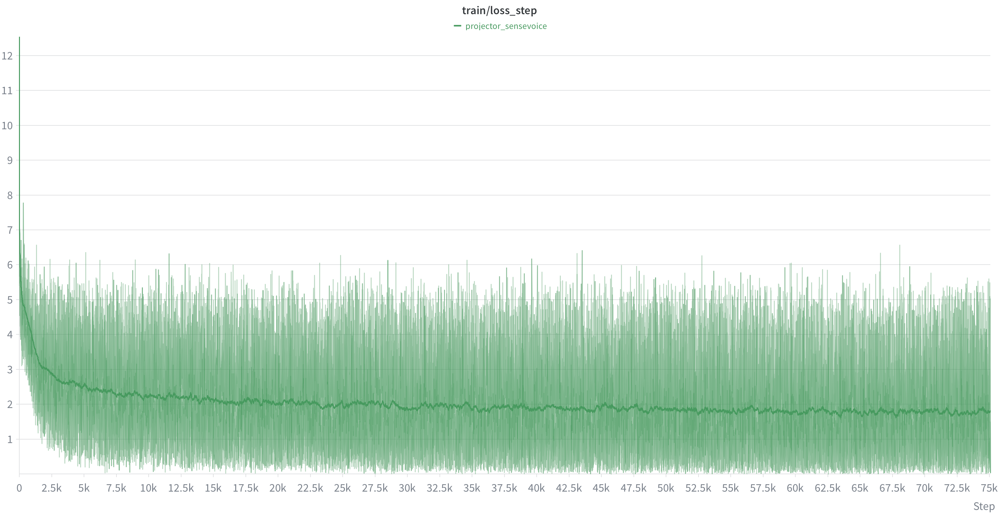
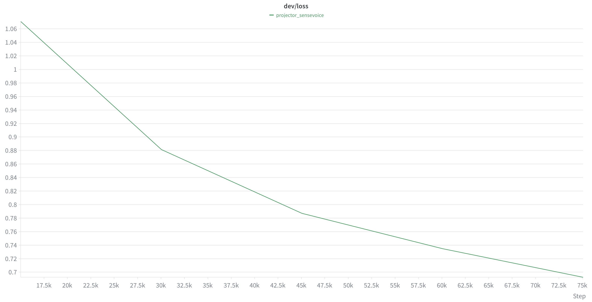
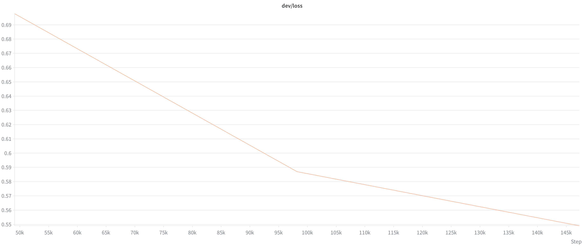
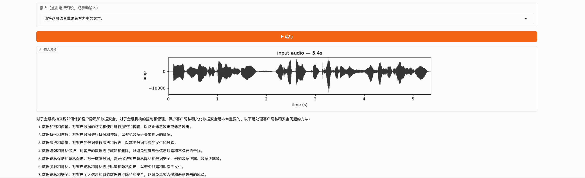

# Speech-MiniMind

> **项目定位**：Speech-to-Speech。给定一段语音输入，系统要"听懂"并用语音回答。这个仓库把目标拆成两条可独立推进的技术路线，最终殊途同归——让机器能听、能想、能说。

从一段 WAV 开始，亲手构建一个中文 Speech LLM：WAV → FFT → Mel → Tiny Conformer + CTC → Speech Projector → MiniMind。

目标：能看懂、能运行、能修改的整套教学流水线。

## 两条实现路线

### 路线 A：通用 LLM 前挂语音编码器 + 后接 TTS（级联式）

```
语音输入 ──► 声学编码器(→ Projector) ──► 通用LLM(MiniMind) ──► 文本回答 ──► TTS ──► 语音输出
```

- 先训练**声学编码器**（Tiny Conformer + CTC / Paraformer）把语音变成帧级特征，再接入通用 LLM。
- LLM 负责理解与推理，输出**文本**；文本经**TTS**合成语音回答。
- 优点：复用成熟 LLM 与 TTS，文本能力强、可控性好；缺点是语音信息在"量化到文本"这一步有损，级联误差累积。

### 路线 B：音频专属 LLM（离散 codebook 端到端）

```
语音输入 ──► 量化编码器(codebook) ──► 音频专属LLM ──► 解码器 ──► 语音输出
```

- 语音**直接**经过量化编码器生成**codebook**（离散 token 序列），全程音频时域。
- 由**音频专属的 LLM** 在 token 序列上建模、理解并生成。
- 生成的 codebook 再经**解码器**还原为波形，端到端输出语音。
- 优点：语音信息无文本有损，更接近"听"的本质；缺点是需专用数据与更大的训练成本。

> 两条路线共享同一份**语音理解**基础，可并行演进、互为对照。以下文档先按**路线 A** 搭建教学主线。

```text
00 语音基础 → 01 Mel 频谱 → 02 声学编码器（Tiny Conformer + CTC，含流式版） → 03 接入 MiniMind → 04 指令微调语音 LLM
```

分章教学文档见 [`docs/`](docs/)：

| 章节 | 内容 | 文档 |
|---|---|---|
| 00 语音基础 | WAV、波形、FFT、STFT | [docs/00_audio_basics.md](docs/00_audio_basics.md) |
| 01 Mel 频谱 | 功率谱、Mel 滤波器组、log-Mel | [docs/01_mel_spectrogram.md](docs/01_mel_spectrogram.md) |
| 02 声学编码器 | Tiny Conformer、AISHELL-1、CTC；流式 Conformer（因果分块版） | [docs/02_acoustic_encoder.md](docs/02_acoustic_encoder.md) |
| 03 接入 MiniMind | Speech Projector、语音前缀 | [docs/03_speech_minimind.md](docs/03_speech_minimind.md) |
| 04 指令微调语音 LLM | 合并指令数据、LoRA 微调 MiniMind | 见下方第 7/8 节 |
| 05 音频专属 LLM | 离散 codebook、冻结 codec、音频 LM 预训练与语音到语音微调（路线 B） | [docs/05_audio_native_llm.md](docs/05_audio_native_llm.md) |

## 路线 A：级联式 Speech LLM 端到端实现（教学主线）

下面从环境准备到最终微调，把**路线 A** 完整走一遍：编码器 → Projector → 指令微调语音 LLM →（文本回答，可接 TTS 输出语音）。

### 环境安装

```bash
conda create -n speech-llm python=3.11
conda activate speech-llm
python -m pip install -r requirements.txt
```

### 多卡训练（DDP）

第 3 / 5 / 8 节的四个训练脚本（`train_conformer_ctc.py`、`train_conformer_streaming_ctc.py`、`train_speech_projector.py`、`train_speech_minimind.py`）都已支持多卡分布式训练，下面的所有训练命令都用 `torchrun --nproc_per_node=<N>` 启动，并用 `CUDA_VISIBLE_DEVICES` **显式指定使用哪几张卡**（共享服务器上其他任务会占显存，必须挑空闲卡）。

启动前先确认哪些卡空闲（`memory.free` 大的才是可用卡）：

```bash
nvidia-smi --query-gpu=index,memory.used,memory.free --format=csv
```

- `CUDA_VISIBLE_DEVICES=0,1,2,3` 指定本次使用的 GPU 卡号（可任意挑选，按需调整）；`--nproc_per_node=<N>` 必须等于你指定的卡数，否则会报错或撞上被占用的卡。
- `--nproc_per_node=<N>` 开 N 张卡；脚本按 rank 自动分配设备、用 `DistributedSampler` 切分数据、跨卡求平均 loss。
- 训练/验证 loss、checkpoint、`metrics.csv`、`loss_curve.png`、wandb 记录全部只在 rank 0 执行，各卡模型权重经梯度同步保持一致。
- 需要单卡训练时，把开头的 `torchrun --nproc_per_node=<N>` 换成 `python`，并用 `CUDA_VISIBLE_DEVICES=<一张空闲卡>` 指定该卡即可（无 `RANK`/`WORLD_SIZE`/`LOCAL_RANK` 环境变量时脚本自动退化为单卡行为）。

### 1. 语音分析（00/01）

对示例音频生成波形、频谱、STFT 动画：

```bash
python scripts/analyze_audio.py examples/disgusted_to_happy.wav \
  --plot outputs/example.png --stft-plot outputs/stft.png --stft-gif outputs/stft_process.gif
```

### 2. AISHELL-1 数据准备（02）

```bash
# 下载数据（国内用 ModelScope 镜像，支持断点续传）
python scripts/download_aishell1.py

# 生成 train/dev/test.csv 和 vocab.txt
python scripts/prepare_aishell1.py
```

### 3. 训练中文声学编码器（02，Tiny Conformer + CTC）

#### 非流式（离线整句识别）

```bash
CUDA_VISIBLE_DEVICES=0,1,2,3 torchrun --nproc_per_node=4 trainer/train_conformer_ctc.py \
  --data data/aishell1/processed --epochs 20 --batch-size 32 --lr 2e-4
```

输出到 `outputs/02_acoustic_encoder/`：`metrics.csv`、`loss_curve.png`、逐 epoch checkpoint、`tiny_conformer_ctc.pt`。

#### 流式（chunk-based 因果版）

同一编码器任务的流式实现，用于边听边出的实时场景：

+ **模型**：`model/conformer_streaming.py`（因果下采样、因果卷积、分块因果注意力 + 左上下文缓存）、`model/ctc_streaming.py`（流式 CTC 封装）
+ **训练**：

```bash
CUDA_VISIBLE_DEVICES=0,1,2,3 torchrun --nproc_per_node=4 trainer/train_conformer_streaming_ctc.py \
  --data data/aishell1/processed --epochs 20 --batch-size 32 --lr 2e-4 \
  --chunk-size 32 --left-context 16
```


训练过程（AISHELL-1，约 37k step）的 CTC loss 曲线：

| train/ctc_loss_step | dev/ctc_loss |
|---|---|
|  |  |

train loss 从约 7 收敛到约 0.5；dev loss 从约 3.0 稳定下降到约 0.9。

### 4. 评估声学编码器（02）

```bash
# 一键报告：dev/test CER、checkpoint 对比、样例、RTF
python scripts/evaluate_conformer_report.py \
  --data data/aishell1/processed --output outputs/02_acoustic_encoder --split both

# 单 checkpoint 评估
python scripts/evaluate_conformer_ctc.py \
  --data data/aishell1/processed \
  --checkpoint outputs/02_acoustic_encoder/checkpoint_epoch_020.pt --split dev
```

同目录还有 `scripts/plot_training_metrics.py` 可绘制训练曲线。

### WebUI 流式 vs 非流式演示

运行 `scripts/visualize_asr_webui.py`（Gradio）可视化 02 章声学编码器，左右对比非流式（整句）与流式（增量）识别效果：

```bash
python -m pip install gradio   # 首次需要

python scripts/visualize_asr_webui.py \
  --checkpoint outputs/02_acoustic_encoder/tiny_conformer_ctc.pt \
  --stream-checkpoint outputs/02_streaming_acoustic_encoder/tiny_streaming_conformer_ctc.pt \
  --audio path/to/long.wav
```

> 两侧模型 checkpoints **不可互换**（下采样与卷积结构不同）：非流式用 `outputs/02_acoustic_encoder/` 训练的权重，流式侧需显式传入 `--stream-checkpoint` 才会启用。只演示一侧时省略对应参数即可（`pip install gradio` 首次安装）。启动后访问 `http://0.0.0.0:7860`。


> **关于本套编码器的泛化性声明**：我们的 Tiny Conformer + CTC 编码器只在**中文 AISHELL-1**（16kHz 平稳播音、整句 2–6s）上训练，且**模型参数量较小**（约 Tiny 规模），因此对**训练分布外的输入难以有较好的泛化性能**——例如带口音/方言、语速异常、嘈杂或更长的音频，识别效果会明显下降甚至出现乱码。这属于预期行为，并非代码 bug；如果你需要更通用、更强的声学编码，**建议用开源的成熟编码器**（如 FunASR 的 Paraformer-zh-streaming、Whisper/OpenAI、语音自监督前端 wav2vec 2.0 / HuBERT 等）来达到更好的效果，本项目的编码器更多用于教学演示与完整流水线打通。

我们训练好的 02 章「Tiny Conformer + CTC」编码器权重（**流式**与**非流式**）会发布在 ModelScope 仓库：<https://www.modelscope.cn/models/ghjghj1017/Tiny_Conformer>。你可以直接下载使用，省去本地重新训练。

### 换用成熟开源编码器（推荐 FunASR / SenseVoice-Small）

如果后续要换成开源的成熟声学编码器，**推荐用 FunASR 的 SenseVoice-Small**。它是离线非自回归模型，适合批量提取帧级 encoder hidden states。首次使用时安装依赖并下载模型：

```bash
python -m pip install funasr modelscope

# 默认可由 FunASR 自动下载；也可提前下载到本地目录
python -c "from modelscope.hub.snapshot_download import snapshot_download; snapshot_download('iic/SenseVoiceSmall', local_dir='outputs/sensevoice-small')"
```

SenseVoice 不需要流式 encoder。仓库的 `SenseVoiceFrozenEncoder` 会使用 SenseVoice 的离线 `WavFrontend`，将一个 batch 的 fbank/LFR 特征一次性送入 `SenseVoiceEncoderSmall`，输出批量帧级声学表示，再交给 `SpeechProjector`。编码器参数全程冻结，训练时仍可使用 waveform 和 Mel/Fbank augmentation。

```python
from funasr import AutoModel

model = AutoModel(model="iic/SenseVoiceSmall", device="cuda", disable_update=True)
for p in model.parameters():
    p.requires_grad_(False)
model.eval()
```

> **注意**：SenseVoice 的 encoder hidden state 不是 ASR 文本输出，而是 Projector 使用的连续帧级声学表示。其 encoder 支持 batch forward，输出维度由模型自动读取；当前默认 frontend 为 16kHz、80-bin fbank、LFR `m=7/n=6`。

### 5. 训练语音投影器连接 MiniMind（03，Speech Projector）

使用 **SenseVoice-Small 作为冻结编码器**。先下载 [MiniMind Transformers 权重](https://github.com/jingyaogong/minimind)（如 `minimind-3`）到本地目录，然后：

```bash
CUDA_VISIBLE_DEVICES=0,1,2,3 torchrun --nproc_per_node=4 trainer/train_speech_projector.py \
  --data data/aishell1/processed \
  --encoder-type sensevoice \
  --sensevoice-model outputs/sensevoice-small \
  --minimind-model /path/to/minimind-3 \
  --output outputs/03_speech_minimind_projector --epochs 5 --batch-size 2 \
  --wandb --wandb-name projector_sensevoice
```

无论用哪个后端，都冻结编码器和 MiniMind，只训练约 0.8M 参数的 `SpeechProjector`。这一步得到的是**语音条件的转写桥接模型**，还不是完整的 Speech LLM。

脚本会按所选后端自动设置 `SpeechProjector.acoustic_dim`（SenseVoice 通常为 512，Conformer=256，Paraformer=512），并把输入统一为 16kHz 波形。SenseVoice 的 encoder 会对一个 batch 的 frontend 特征执行批量 forward；对较长训练集可用 `--hidden-cache <dir>` 缓存每段音频的 encoder hidden state，避免每个 epoch 重复跑前端。后续第 8 节的 `train_speech_minimind.py` 也支持同样的 `--encoder-type` / `--sensevoice-model`，保证前后两阶段使用同一编码器。

训练过程（AISHELL-1，约 9.5k step）的 loss 曲线：

| train/loss_step | dev/loss |
|---|---|
|  |  |

train loss 从约 8.5 收敛到约 0.5；dev loss 从约 0.96 稳定下降到约 0.64。

### 6. 构建指令微调数据（用于下一阶段）

> 说明：本节为**下一步完整语音指令微调（Speech LLM）**准备数据；训练第 5 节的 Projector **不需要**它——`train_speech_projector.py` 默认用 `data/aishell1/processed`（CSV）即可。仅当你想用指令格式（`--data-format jsonl`）训练 Projector 时才需运行本节。

先直接把 AISHELL-1 转写标注转成统一的语音指令格式：

```bash
python scripts/prepare_speech_instructions.py \
  --input data/aishell1/processed --output data/speech_instructions
```

每行 JSON：`{"audio": "...", "instruction": "请将这段语音准确转写为中文文本。", "answer": "...", "task": "transcription"}`。

再混合外部指令数据构建小规模训练集：

```bash
python scripts/build_stage2_mixture.py \
  --aishell data/aishell1/processed --sources data/external_speech_instructions \
  --output data/stage2_mixture --total 5000
```

（`data/external_speech_instructions/` 下可选放 `meeting.jsonl`、`instruction.jsonl`、`understanding.jsonl`。）

### 7. 构建并合成语音问答数据 + 合并统一指令集

从多个来源构建问答类语音数据，并合并成一份标准指令微调数据集：

```bash
# 从 moss-003 SFT 抽取中文多轮子集
python scripts/prepare_moss_speech_qa.py --input /path/to/moss.zip --output data/moss_speech_qa

# 用 Qwen3-TTS 把 instruction 文本合成为真实中文音频
python scripts/generate_moss_speech_qa_tts.py --data data/moss_speech_qa

# 从 VoiceAssistant-400K 随机抽样并下载本地音频
python scripts/prepare_voiceassistant_400k.py --num-samples 50000 --output data/voiceassistant400k_50k

# 把 speech_instructions / moss_speech_qa / voiceassistant400k_50k 合并为一份标准指令集
python scripts/merge_speech_instruction_datasets.py \
  --data-root data --output data/stage2_mixed
```

合并脚本输出 `data/stage2_mixed/{train,dev}.jsonl`，每行统一为：
`{"audio": "<绝对路径>", "instruction": "...", "answer": "...", "task": "...", "source": "...", "lang": "zh|en"}`
并把三类数据的音频路径统一解析为绝对路径（三者的相对基准原本不同），moss 的多轮 `history` 会按单轮格式丢弃。可以配合 `--skip-missing-audio` 跳过缺失音频的条目。

三个来源的音频原生采样率不一致（`speech_instructions`/AISHELL=16kHz、`moss_speech_qa`(Qwen3-TTS)=24kHz、`voiceassistant400k_50k`=22050Hz），而下游 `train_speech_minimind.py` 强制要求 **16kHz** 输入。合并后先统一重采样到 16kHz：

```bash
# 需要 soundfile + soxr（无 soxr 时自动回退 scipy）
python -m pip install soundfile soxr

python scripts/resample_stage2_mixed.py --data data/stage2_mixed --sr 16000
```

脚本把非 16kHz 的音频重采样为 16-bit PCM WAV，写入 `data/stage2_mixed/resampled_audio/{train,dev}/`，并把 `train/dev.jsonl` 中对应行的 `audio` 路径更新到新文件（原音频不动，其余字段保持不变）。脚本幂等：已是 16kHz 的行直接跳过。

### 8. 指令微调语音 LLM（04，真正的 Speech-MiniMind）

在第 5 节的 Projector 桥接基础上，用第 6/7 节的指令数据**微调 MiniMind 本身**（LoRA），让它变成能听语音、理解指令、生成回答的完整 Speech LLM：

```bash
CUDA_VISIBLE_DEVICES=0,1,2,3 torchrun --nproc_per_node=4 trainer/train_speech_minimind.py \
  --data data/stage2_mixed \
  --encoder-type sensevoice \
  --sensevoice-model outputs/sensevoice-small \
  --projector-checkpoint outputs/03_speech_minimind_projector/projector_epoch_005.pt \
  --minimind-model /path/to/minimind-3 \
  --output outputs/04_speech_minimind_sft --epochs 3 --batch-size 2 \
  --lora-r 8 --lora-alpha 16 \
  --wandb --wandb-name speech_minimind_sft
```

默认冻结语音编码器和 Speech Projector，只对 MiniMind 做指令微调；如果希望在指令微调阶段同步适配 Projector，可显式打开可选参数：

```bash
# Projector 与 MiniMind 一起训练；--projector-lr 不传时复用 --lr
CUDA_VISIBLE_DEVICES=0,1,2,3 torchrun --nproc_per_node=4 trainer/train_speech_minimind.py \
  --data data/stage2_mixed \
  --encoder-type sensevoice --sensevoice-model outputs/sensevoice-small \
  --projector-checkpoint outputs/03_speech_minimind_projector/projector_epoch_005.pt \
  --minimind-model /path/to/minimind-3 \
  --output outputs/04_speech_minimind_sft --epochs 3 --batch-size 2 \
  --tune full --tune-projector --projector-lr 5e-5 \
  --wandb --wandb-name speech_minimind_sft
```

- `--tune lora`（默认）：只对 MiniMind 注入并训练 **LoRA adapter**（约 0.5% 可训练参数）；`--tune full`：全参数微调 MiniMind。
- 默认冻结语音编码器和 Speech Projector；传入 `--tune-projector` 后会把 Projector 加入优化器，与 MiniMind 一起训练。可用 `--projector-lr` 单独设置学习率（不传时复用 `--lr`）。编码器始终冻结。
- 损失只在 `answer` 部分计算（prompt 与语音前缀用 -100 mask），标准 SFT。
- `--augment`（默认开启）：在 Dataset 的 `__getitem__` 阶段按样本随机增强训练音频，原始音频文件不会被修改；验证集始终不增强。使用 `--no-augment` 可关闭。当前包括随机变速、加噪、音量、时间遮挡、低通和简易混响。
- `--augment-mel`（默认开启）：在声学前端生成 Mel/Fbank 后，按 batch 随机做 SpecAugment 的频率遮挡和时间遮挡；同样只作用于训练集，验证集关闭。使用 `--no-augment-mel` 可关闭。
- 常见参数：`--tune lora|full`、`--tune-projector`、`--projector-lr`、`--augment`、`--lang-filter zh|en`（只练单一语言）、`--limit N`（先小规模试跑）、`--lora-r/--lora-alpha`（LoRA 秩）、`--epochs`、`--wandb`（上传指标，可选 `--wandb-project <name>`、`--wandb-name <run>`，project 默认 `Speech-MiniMind`）。
- `--tune lora` 依赖 `peft`：`python -m pip install peft`。
- 开启 Projector 微调时，每个 epoch 额外保存 `projector_epoch_XXX.pt`，可直接作为后续推理或继续训练的 `--projector-checkpoint`。
- 输出 `outputs/04_speech_minimind_sft/`：`config.json`、`metrics.csv`、`lora_epoch_XXX/adapter_model.safetensors`（lora 模式）或 `model_epoch_XXX/model.safetensors`（full 模式，完整可加载模型）。

训练过程（stage2 混合指令集，约 145k step / 3 epoch）的 loss 曲线：

| train/loss_step | dev/loss |
|---|---|
|  |  |

train loss 从约 8 收敛到约 0.85；dev loss 稳定下降到约 0.58。

### 9. 测试指令微调模型（推理 / WebUI 互动平台）

第 8 节只生成 checkpoint，仓库补了两个**测试入口**来实际"用"模型：一个 CLI 推理脚本（`infer_speech_minimind.py`）和一个网页互动平台（`visualize_speech_minimind_webui.py`，FastAPI + WebSocket）。两者复用同一套推理管线：

```text
WAV ──▶ frozen 声学编码器(sensevoice/conformer/paraformer) ──▶ SpeechProjector(冻结)
        ──▶ 语音前缀 embeddings ⊕ 指令文本 tokens ──▶ MiniMind(微调后) ──▶ 回答文本
```

因为 MiniMind 的输入前缀是**连续语音向量**（不是 token id），`generate_from_speech`（`model/minimind_adapter.py`）会先把语音前缀与指令文本拼成 `inputs_embeds`，优先走 `model.generate(inputs_embeds=...)`，若不支持则回退到逐 token 的自回归贪婪解码。

#### CLI 推理

```bash
# full 全参微调模型 + paraformer 前端（推荐）
python scripts/infer_speech_minimind.py \
  --audio path/to/utterance.wav \
  --instruction "请将这段语音准确转写为中文文本。" \
  --encoder-type sensevoice \
  --sensevoice-model outputs/sensevoice-small \
  --projector-checkpoint outputs/03_speech_minimind_projector/projector_epoch_005.pt \
  --minimind-model outputs/04_speech_minimind_sft/model_epoch_003

# 同样可用 conformer 前端 + tiny-conformer 训练的 projector
python scripts/infer_speech_minimind.py \
  --audio path/to/utterance.wav \
  --instruction "请将这段语音准确转写为中文文本。" \
  --encoder-checkpoint outputs/02_acoustic_encoder/tiny_conformer_ctc.pt \
  --projector-checkpoint outputs/03_speech_minimind_projector/projector_epoch_005.pt \
  --minimind-model outputs/04_speech_minimind_sft/model_epoch_003
```

- `--minimind-model`：第 8 节输出目录。`full` 传 `model_epoch_XXX/`；`lora` 传 `lora_epoch_XXX/`（需 `--tune lora`，脚本会用 peft 重新挂载 adapter）。
- 输入 WAV 非 16kHz 时自动重采样到 16kHz（paraformer 前端强制要求 16kHz）。
- 可选 `--temperature`（>0 采样）、`--max-new-tokens`、`--verbose`。

#### WebUI 互动平台（FastAPI + WebSocket，双模式）

```bash
python -m pip install fastapi uvicorn soundfile qwen-tts   # 首次需要

# 局域网访问 + 麦克风 + MiniMind 文本回答转语音
python scripts/visualize_speech_minimind_webui.py \
  --encoder-type sensevoice \
  --sensevoice-model outputs/sensevoice-small \
  --projector-checkpoint outputs/03_speech_minimind_projector/projector_epoch_005.pt \
  --minimind-model outputs/04_speech_minimind_sft/model_epoch_003 \
  --tts-model /gpu3/guhj/models/Qwen3-TTS-12Hz-1.7B-CustomVoice \
  --tts-speaker Serena \
  --host 0.0.0.0 --port 7861 --ssl-auto
```

启动时传入 `--tts-model` 后，MiniMind 每次生成最终文本回答，服务端会调用 Qwen3-TTS 的 `generate_custom_voice` 合成为 WAV，并通过同一条 WebSocket 返回浏览器自动播放；不传该参数时保留原来的纯文本模式。可用 `--tts-speaker Serena` 和 `--tts-language Chinese` 选择 Qwen3-TTS 的预置音色与语言。

启动后浏览器访问 `https://<host>:7861`（用 `--ssl-auto`）或 `http://localhost:7861`（端口转发），页面提供两个模式页签：

- **① 音频上传**：选择本地音频文件（WAV / MP3 / M4A 等）→ 选择/输入指令（内置转写、概括、话题、翻译等预设）→ 点"运行"。服务端用 `ffmpeg` 把音频解码成 16kHz 单声道（无 ffmpeg 时回退到标准库 `wave`，仅支持 16-bit PCM WAV），显示输入波形并流式输出回答。也有一次性 HTTP 接口：`POST /api/infer?instruction=...`，请求体直接是音频字节，返回 JSON。
- **② 麦克风实时**：点击"开始监听"后浏览器采集 16kHz 单声道 PCM，通过**一条常连的 WebSocket**（`/ws`）持续推送到服务端。服务端内置的**能量 VAD**（自适应噪声底，无需 `webrtcvad`）实时断句：检测到说话结束后自动跑模型，并把回答**逐 token 流式**回传，停顿即出字、无需每次点按。页面可实时调整 VAD 灵敏度与断句静音时长，并显示麦克风电平。

> 麦克风需要**安全上下文**：仅在 `http://localhost` 或 `https://` 下浏览器才允许 `getUserMedia`。两种做法二选一：
>
> 1. **推荐：`--ssl-auto`**（上面命令已带）。脚本首次启动时用 `openssl` 生成自签证书（存在 `scripts/.webui_ssl/`，之后复用），用 `https://<host>:7861` 访问。浏览器会提示证书不受信任，点一次「高级 → 继续前往 \<host\>」即可，此后即为安全上下文，任何浏览器/设备都能用麦克风。也可自己指定证书：`--ssl-keyfile key.pem --ssl-certfile cert.pem`。
> 2. **端口转发**：`ssh -N -L 7861:127.0.0.1:7861 <user>@<host>`，再访问 `http://localhost:7861`。
>
> （`http://192.168.x.x:7861` 这类明文局域网地址浏览器一律拒绝麦克风，与页面代码无关。）

VAD 相关参数（默认值适合安静的近距离说话）：

| 参数 | 默认 | 说明 |
| --- | --- | --- |
| `--vad-frame-ms` | `30` | 每帧时长（毫秒） |
| `--vad-start-mult` | `2.5` | 帧能量 > 噪声底 × 该值视为起句 |
| `--vad-stop-mult` | `1.5` | 帧能量 < 噪声底 × 该值计入静音 |
| `--vad-min-speech-ms` | `250` | 最短语音时长，低于此不算一句话 |
| `--vad-silence-ms` | `700` | 断句所需尾部静音时长 |
| `--vad-max-utterance-s` | `30` | 单句硬上限，超过强制切分 |
| `--no-vad-adaptive` | 关 | 关闭后冻结噪声底，不做自适应 |
| `--ssl-auto` | 关 | 生成/复用 `scripts/.webui_ssl/` 自签证书并以 https 提供服务（麦克风必需） |

其余参数（`--tune`、`--max-new-tokens`、`--max-speech-tokens`、`--temperature` 等）与 CLI 一致。

实际运行效果（上传一段语音，模型转写为中文文本）：



> 本机（Mac/CPU）只会把 `outputs/` 留空、不做对待训练——测试平台需要真实 checkpoint 与 GPU。把上面命令在**训练过该模型的 GPU 机器**上执行即可，所有权重都从你传入的路径加载，仓库不额外下载任何东西。

## 路线 B：音频专属 LLM（离散 codebook 端到端）

路线 A 把语音变成**连续**向量再交给通用 LLM，输出**文本**；路线 B 则把语音量化成**离散 codebook token**，让 LLM 直接在 token 序列上建模并生成，再由解码器还原波形：

```text
WAV ──► 冻结 codec 编码器 ──► 离散 audio tokens ──► 音频专属 LLM
                                                    │
                              WAV ◄── 冻结 codec 解码器 ◄── 生成的 audio tokens
```

与路线 A 的三点关键差异：

- **必须扩词表**：把 `codebook_size × num_codebooks` 个音频 token 追加到文本词表之后，再训练 `embed_tokens` / `lm_head` 的新增行（LoRA 覆盖不到，因此路线 B 默认 `--tune full`）。
- **输入输出同为离散 token**：序列是 `[BOS] <|audio_start|> 输入语音 <|audio_end|> <|audio_start|> 输出语音 <|audio_end|> [EOS]`，损失只算输出语音段。
- **不复用路线 A 的连续前缀**：两条路线共享数据与训练骨架，但序列布局独立。

完整教学文档见 [docs/05_audio_native_llm.md](docs/05_audio_native_llm.md)。

### 1. 确认 codec 重建质量（05，M0 闸门）

路线 B 的第一道闸门：冻结 codec 必须能把中文语音编成离散 token 再还原回「人能听懂」的波形，否则后面的音频 LM 训练没有意义。

```bash
python scripts/eval_codec_reconstruction.py \
  --data data/aishell1/processed --split dev --num 20 \
  --codec-type mimi --device cuda:0 --output outputs/05_route_b_codec_check
```

输出重建失真 / STOI / PESQ / 往返 ASR CER 到 `outputs/05_route_b_codec_check/`。

`--data` 支持三种输入，中英文与「回答音频域」都能用同一条命令跑：AISHELL 风格目录（读 `{split}.csv` 的 `path`/`text`）、项目 JSONL 清单（读 `audio` + 文本参照，或读 `answer_codes` + `answer_text`）、或直接指定单个清单文件。用 `--asr-language` 指定识别语言，评分单位随之从字符级 CER 切换为词级 WER：

```bash
# 英文数据集：重建 + 识别质量（WER）
python scripts/eval_codec_reconstruction.py \
  --data data/voiceassistant400k_50k --split dev --num 20 \
  --asr-language en --codec-type mimi --device cuda:0 \
  --output outputs/05_route_b_codec_check_en

# sft_a2a 回答音频域：只有 code 没有波形，直接解码后算往返错误率（zh/en 都行）
python scripts/eval_codec_reconstruction.py \
  --data data/route_b/s2s --split dev --num 50 \
  --asr-language en --codec-type mimi --device cuda:0 \
  --output outputs/05_route_b_codec_check_s2s_en
```

#### 实测结果（Mimi 8×2048，全量 dev 集）

`--num 0` 表示不抽样、评整个 split。以下为在 95 上用 `--codec-type mimi` 跑完全量 dev 的结果：

| 数据集 | 语言 / 评分单位 | 样本数 | `mel_mae` | 错误率 | `tokens_per_s` |
|---|---|---|---|---|---|
| `data/aishell1/processed`（dev） | zh / 字符级 CER | 14,326 | 2.5791 | **0.1498** | 12.6171 |
| `data/voiceassistant400k_50k`（dev） | en / 词级 WER | 2,500 | **1.8593** | **0.1659** | 12.6545 |

读法：**英文的重建失真更低**（`mel_mae` 1.86 vs 2.58），但中文的识别错误率反而更好（CER 0.150 < WER 0.166）——两者单位不同（字符 vs 词），不能直接比大小，只能各自与自己的阈值比。两边的 `tokens_per_s` 都稳定在 12.6，与 Mimi 的 12.5 Hz 标称帧率吻合，说明编解码长度对齐没有偏差。结论：**冻结 Mimi 8 码本在中英文上都可用，M0 闸门通过，无需切换 codec。**

### 2. 构建语音到语音数据（05）

优先用 MiniMind-O 已经 token 化好的 `sft_a2a`（`--download` 会从 ModelScope 拉取）：

```bash
python scripts/prepare_speech_to_speech.py --download \
  --file-name sft_a2a.parquet --lang zh \
  --output data/route_b/s2s --device cuda:0
```

输出 `data/route_b/s2s/{train,dev}.jsonl` + `codes/` 缓存。

> 完整 `sft_a2a.parquet` 有 414024 行 / 5.7 GB，中文占约 34.65% 且偏向文件后段，用 `--limit` 抽小样本时可能一条中文都取不到（统计里会显示 `kept: 0`）；冒烟请用 `--file-name sft_a2a_mini.parquet`，或把 `--limit` 调大。读取按 row group 流式进行。

### 3. 构建纯音频语料与 token 缓存（05，可选 B0 前置）

B0 只需要「一串串音频」，不需要问答配对。这一步把散落在各数据集里的音频汇总成一份清单，再用冻结 codec **一次性**编码成 `.npy` 离散 token——codec 编码比一次 LLM step 还贵，放进训练循环里每个 epoch 重跑是不可接受的，所以全部离线缓存。

#### 3.1 汇总纯音频清单（`prepare_audio_lm_corpus.py`）

```bash
python scripts/prepare_audio_lm_corpus.py --data-root data --output data/route_b/audio_lm
```

脚本读取三类已有数据，只取其中的音频路径，输出 `data/route_b/audio_lm/{train,dev}.jsonl`：

| 来源 | 读什么 | 语言 | 采样率 |
|---|---|---|---|
| AISHELL-1 | `data/aishell1/processed/{train,dev}.csv` 的 `path` 列 | zh | 16 kHz |
| moss_speech_qa | `data/moss_speech_qa/{train,dev}.jsonl` 的 `audio`（问题是 Qwen3-TTS 合成音） | zh | 24 kHz |
| voiceassistant400k_50k | 同上的 `audio`，**默认不引入**，需加 `--include-english` | en | 22.05 kHz |

每行只有 `{"audio": "<绝对路径>", "source": "...", "lang": "..."}` 三个字段，同时写出 `metadata.json` 记录各来源行数。两个容易踩的点：

- **路径基准不统一**：AISHELL 的 CSV 存的是仓库根相对路径，moss/va 的 JSONL 存的是相对自己目录的路径。脚本会依次尝试「仓库根 / 清单所在目录」，并把结果**统一转成绝对路径**——因为下游 `cache_audio_tokens.py` 是相对它自己的清单目录解析的，这里留相对路径会静默全部失效。
- **采样率不统一**：清单不做重采样，交给 codec 内部处理（codec 是 24 kHz，16 kHz 的 AISHELL 在 `encode` 里会自动上采样）。

无论 AISHELL 还是 moss，这里都只是**列出**音频，真正的量化在下一步。

#### 3.2 编码成离散 token 缓存（`cache_audio_tokens.py`）

```bash
python scripts/cache_audio_tokens.py \
  --data data/route_b/audio_lm --output data/route_b/audio_lm_codes \
  --codec-type mimi --device cuda:0 --batch-size 16
```

脚本按 manifest 逐条读音频 → 按 batch 送进冻结 Mimi → 每条存一个 `.npy`，并把清单重写成指向缓存的版本：

```text
data/route_b/audio_lm_codes/
├── codes/train/0000000.npy      # 每条音频一个 shard，int16，形状 (Q=8, T)
├── codes/dev/0000000.npy
├── train.jsonl                  # 重写后的清单：{"codes": "codes/train/0000000.npy", ...}
├── dev.jsonl
└── metadata.json                # codec 类型 / num_codebooks / codebook_size / sr / frame_rate
```

要点：

- **shard 形状 `(Q, T)`**：`Q=8` 个码本 × `T` 帧，12.5 Hz 即每帧 80 ms，用 `int16` 存（codebook 值 `< 2048`）。训练时 `dataset/audio_token_dataset.py` 会把 `(Q, T)` 展平成 `(T*Q,)` 的 frame-major 序列。
- **可复用 / 可续跑**：默认遇到已存在的 shard 直接跳过（`reused`），加 `--overwrite` 强制重编；`--limit N` 只处理前 N 条（冒烟用）。日志里 `encoded / reused / failed / skipped_long` 四个计数器可直接判断是否正常。
- **过滤规则**：读不出来的音频、编码后长度为 0 的、超过 `--max-seconds`（默认 40 s）的都会被丢弃，并**从清单里删掉对应行**，保证清单不会指向不存在的 `.npy`。这一点是踩过坑的：编码是攒批延迟写入的，所以脚本不能在缓冲期间去探盘判断文件是否存在，只能等最终 flush 后按实际写出的 key 复核一遍。
- **缓存带元信息**：`metadata.json` 记录 codec 类型与码本参数，换 codec 必须换 `--output` 目录，避免旧 token 被静默复用。
- **清单只在最后一次性写出**：所以缓存运行到一半时 `train.jsonl` 还不存在，训练脚本此刻读会报 `FileNotFoundError`，属预期行为。

> 如果第 2 节（`sft_a2a`）已经把回答侧 token 一起产出了，那部分音频就**不需要再走本步**：`prepare_speech_to_speech.py` 直接从 parquet 里取回答 token、只把问题音频过一遍 Mimi，`.npy` 落在同一套 `codes/` 布局下（回答侧 `*_a.npy`、问题侧 `*_p.npy`）。本节只针对 B0 的纯音频语料。

### 4. B0 音频 LM 预训练（05，可选）

在纯音频语料上先学 codec token 的分布，再用它初始化第 5 节：

```bash
CUDA_VISIBLE_DEVICES=6,7 torchrun --nproc_per_node=2 \
  trainer/train_audio_lm_pretrain.py \
  --data data/route_b/audio_lm_codes \
  --minimind-model /gpu3/guhj/models/minimind-3 \
  --output outputs/05_route_b_audio_lm --epochs 3 --batch-size 8 \
  --tune full --num-workers 4 --wandb --wandb-name route_b_b0
```

### 5. 语音到语音指令微调（06，B1/B2）

只监督回答语音段（prompt / 输入音频 / padding 全部 `-100`）：

```bash
CUDA_VISIBLE_DEVICES=6,7 torchrun --nproc_per_node=2 \
  trainer/train_speech_to_speech.py \
  --data data/route_b/s2s \
  --init-from outputs/05_route_b_audio_lm/model_epoch_003 \
  --output outputs/06_route_b_s2s --epochs 3 --batch-size 4 \
  --tune full --num-workers 4 --wandb --wandb-name route_b_s2s
```

不跑 B0 时可去掉 `--init-from`，直接用 MiniMind 权重冷启动。

### 6. 端到端推理（06）

```bash
python scripts/infer_speech_to_speech.py \
  --audio examples/disgusted_to_happy.wav \
  --model outputs/06_route_b_s2s/model_epoch_003 \
  --codec-type mimi --device cuda:0 --output outputs/route_b_answer.wav
```

> codec 为冻结的预训练模型（Mimi 8×2048、12.5 Hz、24 kHz；EnCodec 24 kHz 作对照），仓库不训练 codec。第一阶段的 s2s 数据主要来自 MiniMind-O `sft_a2a` 与自建 TTS 合成配对，**音色单一、无真实噪声**，属于教学闭环的已知局限，不能当作真实场景泛化结论。


## 目录结构

```text
Speech-MiniMind/
├── docs/        # 分章教学文档
├── assets/      # README 插图（训练曲线等）
├── examples/    # 示例音频
├── model/       # Conformer、CTC、流式版、Projector、MiniMind 适配、音频 codec / 音频 LM（路线 B）
├── dataset/     # Dataset 与训练时随机音频增强（含路线 B 的 token 数据集）
├── trainer/     # 各阶段训练脚本
├── scripts/     # 数据准备 / 下载 / 评估 / 推理 / WebUI
├── data/        # 本地数据，不提交
├── outputs/     # 图表、日志、checkpoint，不提交
├── requirements.txt
└── README.md
```

## 开源说明

数据集遵循 AISHELL-1 原始许可；`data/`、`outputs/`、`.pt`、压缩包不提交仓库。正式发布前会补充代码许可证与数据集引用。