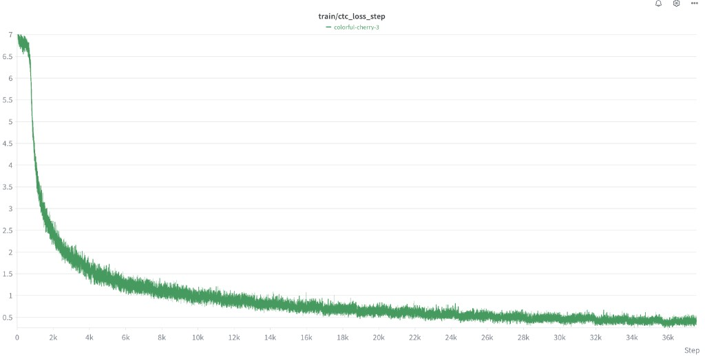
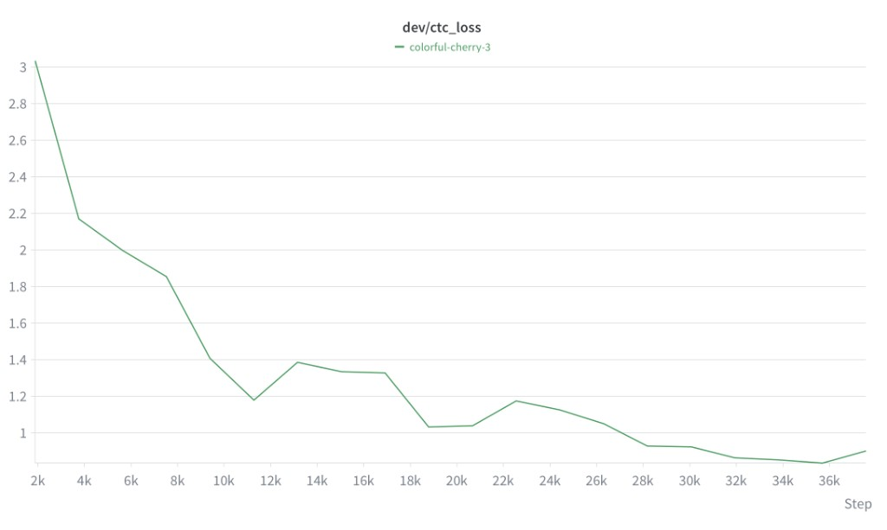
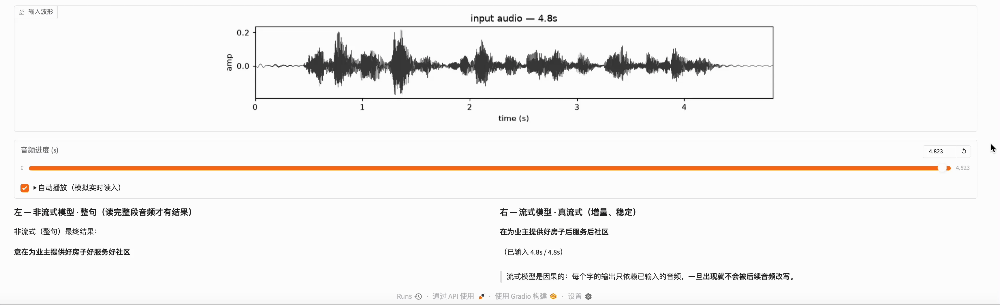

# Speech-MiniMind

从一段 WAV 开始，亲手构建一个中文 Speech LLM：WAV → FFT → Mel → Tiny Conformer + CTC → Speech Projector → MiniMind。

目标：能看懂、能运行、能修改的整套教学流水线。

```text
00 语音基础 → 01 Mel 频谱 → 02 声学编码器（Tiny Conformer + CTC，含流式版） → 03 接入 MiniMind → 04 指令微调语音 LLM
```

分章教学文档见 [`docs/`](docs/)：

| 章节 | 内容 | 文档 |
|---|---|---|
| 00 语音基础 | WAV、波形、FFT、STFT | [docs/00_audio_basics.md](docs/00_audio_basics.md) |
| 01 Mel 频谱 | 功率谱、Mel 滤波器组、log-Mel | [docs/01_mel_spectrogram.md](docs/01_mel_spectrogram.md) |
| 02 声学编码器 | Tiny Conformer、AISHELL-1、CTC；流式 Conformer（因果分块版） | [docs/02_acoustic_encoder.md](docs/02_acoustic_encoder.md) |
| 03 接入 MiniMind | Speech Projector、语音前缀 | [docs/03_speech_minimind.md](docs/03_speech_minimind.md) |
| 04 指令微调语音 LLM | 合并指令数据、LoRA 微调 MiniMind | 见下方第 7/8 节 |

## 环境安装

```bash
conda create -n speech-llm python=3.11
conda activate speech-llm
python -m pip install -r requirements.txt
```

### 1. 语音分析（00/01）

对示例音频生成波形、频谱、STFT 动画：

```bash
python scripts/analyze_audio.py examples/disgusted_to_happy.wav \
  --plot outputs/example.png --stft-plot outputs/stft.png --stft-gif outputs/stft_process.gif
```

### 2. AISHELL-1 数据准备（02）

```bash
# 下载数据（国内用 ModelScope 镜像，支持断点续传）
python scripts/download_aishell1.py

# 生成 train/dev/test.csv 和 vocab.txt
python scripts/prepare_aishell1.py
```

### 3. 训练中文声学编码器（02，Tiny Conformer + CTC）

#### 非流式（离线整句识别）

```bash
python scripts/train_conformer_ctc.py \
  --data data/aishell1/processed --epochs 20 --batch-size 32 --lr 2e-4
```

输出到 `outputs/02_acoustic_encoder/`：`metrics.csv`、`loss_curve.png`、逐 epoch checkpoint、`tiny_conformer_ctc.pt`。

#### 流式（chunk-based 因果版）

同一编码器任务的流式实现，用于边听边出的实时场景：

+ **模型**：`model/conformer_streaming.py`（因果下采样、因果卷积、分块因果注意力 + 左上下文缓存）、`model/ctc_streaming.py`（流式 CTC 封装）
+ **训练**：

```bash
python scripts/train_conformer_streaming_ctc.py \
  --data data/aishell1/processed --epochs 20 --batch-size 32 --lr 2e-4 \
  --chunk-size 32 --left-context 16
```


训练过程（AISHELL-1，约 37k step）的 CTC loss 曲线：

| train/ctc_loss_step | dev/ctc_loss |
|---|---|
|  |  |

train loss 从约 7 收敛到约 0.5；dev loss 从约 3.0 稳定下降到约 0.9。

### 4. 评估声学编码器（02）

```bash
# 一键报告：dev/test CER、checkpoint 对比、样例、RTF
python scripts/evaluate_conformer_report.py \
  --data data/aishell1/processed --output outputs/02_acoustic_encoder --split both

# 单 checkpoint 评估
python scripts/evaluate_conformer_ctc.py \
  --data data/aishell1/processed \
  --checkpoint outputs/02_acoustic_encoder/checkpoint_epoch_020.pt --split dev
```

同目录还有 `scripts/plot_training_metrics.py` 可绘制训练曲线。

### WebUI 流式 vs 非流式演示

运行 `scripts/visualize_asr_webui.py`（Gradio）可视化 02 章声学编码器，左右对比非流式（整句）与流式（增量）识别效果：

```bash
python -m pip install gradio   # 首次需要

python scripts/visualize_asr_webui.py \
  --checkpoint outputs/02_acoustic_encoder/tiny_conformer_ctc.pt \
  --stream-checkpoint outputs/02_streaming_acoustic_encoder/tiny_streaming_conformer_ctc.pt \
  --audio path/to/long.wav
```

> 两侧模型 checkpoints **不可互换**（下采样与卷积结构不同）：非流式用 `outputs/02_acoustic_encoder/` 训练的权重，流式侧需显式传入 `--stream-checkpoint` 才会启用。只演示一侧时省略对应参数即可（`pip install gradio` 首次安装）。启动后访问 `http://0.0.0.0:7860`。



> **关于本套编码器的泛化性声明**：我们的 Tiny Conformer + CTC 编码器只在**中文 AISHELL-1**（16kHz 平稳播音、整句 2–6s）上训练，且**模型参数量较小**（约 Tiny 规模），因此对**训练分布外的输入难以有较好的泛化性能**——例如带口音/方言、语速异常、嘈杂或更长的音频，识别效果会明显下降甚至出现乱码。这属于预期行为，并非代码 bug；如果你需要更通用、更强的声学编码，**建议用开源的成熟编码器**（如 Whisper/OpenAI、语音自监督前端 wav2vec 2.0 / HuBERT 等）来达到更好的效果，本项目的编码器更多用于教学演示与完整流水线打通。

我们训练好的 02 章「Tiny Conformer + CTC」编码器权重（**流式**与**非流式**）会发布在 ModelScope 仓库：<https://www.modelscope.cn/models/ghjghj1017/Tiny_Conformer>。你可以直接下载使用，省去本地重新训练。

### 换用成熟开源编码器（推荐 Whisper-Small）

如果后续要换成开源的成熟声学编码器，**推荐用 Whisper**（Apache-2.0 开源，权重与接口都很稳定），把前面的 Tiny Conformer + CTC 替换掉。先用脚本下载 **whisper-small**（约 244M 参数）的 Transformers 权重：

```bash
# 生成环境已通过 requirements.txt 带上 huggingface_hub；也可手动安装
python -m pip install -U huggingface_hub

# 默认走 ModelScope 镜像（openai-mirror/whisper-small，国内更快）
python scripts/download_whisper.py --output outputs/whisper-small

# 也可改走 Hugging Face 上游（openai/whisper-small）
python scripts/download_whisper.py --source huggingface --output outputs/whisper-small
```

脚本会把权重、配置、processor/tokenizer 一起下载到 `outputs/whisper-small`，之后用 `transformers` 加载其 encoder 并冻结：

```python
from transformers import WhisperModel
encoder = WhisperModel.from_pretrained("outputs/whisper-small").encoder
for p in encoder.parameters():
    p.requires_grad_(False)
encoder.eval()
```

> Whisper encoder 也吃 **16kHz 的 80 维 log-mel**（25ms / 10ms），与本项目现有 `analyze_audio.log_mel` 一致；接入时需要把 `SpeechProjector` 的 `acoustic_dim` 改成对应维度（whisper-small 为 512）并适配帧率换算。下载后可沿用前面第 5 节「冻结编码器、只训 Projector」的流程。

### 5. 训练语音投影器连接 MiniMind（03，Speech Projector）

先下载 [MiniMind Transformers 权重](https://github.com/jingyaogong/minimind)（如 `minimind-3`）到本地目录，然后：

```bash
python scripts/train_speech_projector.py \
  --data data/aishell1/processed \
  --encoder-checkpoint outputs/02_acoustic_encoder/tiny_conformer_ctc.pt \
  --minimind-model /path/to/minimind-3 \
  --output outputs/03_speech_minimind --epochs 3 --batch-size 2
```

冻结 Conformer 和 MiniMind，只训练约 0.8M 参数的 `SpeechProjector`。这一步得到的是**语音条件的转写桥接模型**，还不是完整的 Speech LLM。

### 6. 构建指令微调数据（用于下一阶段）

> 说明：本节为**下一步完整语音指令微调（Speech LLM）**准备数据；训练第 5 节的 Projector **不需要**它——`train_speech_projector.py` 默认用 `data/aishell1/processed`（CSV）即可。仅当你想用指令格式（`--data-format jsonl`）训练 Projector 时才需运行本节。

先直接把 AISHELL-1 转写标注转成统一的语音指令格式：

```bash
python scripts/prepare_speech_instructions.py \
  --input data/aishell1/processed --output data/speech_instructions
```

每行 JSON：`{"audio": "...", "instruction": "请将这段语音准确转写为中文文本。", "answer": "...", "task": "transcription"}`。

再混合外部指令数据构建小规模训练集：

```bash
python scripts/build_stage2_mixture.py \
  --aishell data/aishell1/processed --sources data/external_speech_instructions \
  --output data/stage2_mixture --total 5000
```

（`data/external_speech_instructions/` 下可选放 `meeting.jsonl`、`instruction.jsonl`、`understanding.jsonl`。）

### 7. 构建并合成语音问答数据 + 合并统一指令集

从多个来源构建问答类语音数据，并合并成一份标准指令微调数据集：

```bash
# 从 moss-003 SFT 抽取中文多轮子集
python scripts/prepare_moss_speech_qa.py --input /path/to/moss.zip --output data/moss_speech_qa

# 用 Qwen3-TTS 把 instruction 文本合成为真实中文音频
python scripts/generate_moss_speech_qa_tts.py --data data/moss_speech_qa

# 从 VoiceAssistant-400K 随机抽样并下载本地音频
python scripts/prepare_voiceassistant_400k.py --num-samples 50000 --output data/voiceassistant400k_50k

# 把 speech_instructions / moss_speech_qa / voiceassistant400k_50k 合并为一份标准指令集
python scripts/merge_speech_instruction_datasets.py \
  --data-root data --output data/stage2_mixed
```

合并脚本输出 `data/stage2_mixed/{train,dev}.jsonl`，每行统一为：
`{"audio": "<绝对路径>", "instruction": "...", "answer": "...", "task": "...", "source": "...", "lang": "zh|en"}`
并把三类数据的音频路径统一解析为绝对路径（三者的相对基准原本不同），moss 的多轮 `history` 会按单轮格式丢弃。可以配合 `--skip-missing-audio` 跳过缺失音频的条目。

### 8. 指令微调语音 LLM（04，真正的 Speech-MiniMind）

在第 5 节的 Projector 桥接基础上，用第 6/7 节的指令数据**微调 MiniMind 本身**（LoRA），让它变成能听语音、理解指令、生成回答的完整 Speech LLM：

```bash
python scripts/train_speech_minimind.py \
  --data data/stage2_mixed \
  --encoder-checkpoint outputs/02_acoustic_encoder/tiny_conformer_ctc.pt \
  --projector-checkpoint outputs/03_speech_minimind/projector_epoch_005.pt \
  --minimind-model /path/to/minimind-3 \
  --output outputs/04_speech_minimind_sft --epochs 2 --batch-size 2 \
  --lora-r 8 --lora-alpha 16
```

- 冻结 Conformer 和 Speech Projector（语音前端），只对 MiniMind 做指令微调，支持两种方式（`--tune`）：
  - `--tune lora`（默认）：只对 MiniMind 注入并训练 **LoRA adapter**（约 0.5% 可训练参数），省显存、速度快。
  - `--tune full`：**全参数微调**全部 MiniMind 权重（100% 参数可训练），效果更强但需要更大显存、更慢。
- 损失只在 `answer` 部分计算（prompt 与语音前缀用 -100 mask），标准 SFT。
- 常见参数：`--tune lora|full`、`--lang-filter zh|en`（只练单一语言）、`--limit N`（先小规模试跑）、`--lora-r/--lora-alpha`（LoRA 秩）、`--epochs`、`--wandb`。
- `--tune lora` 依赖 `peft`：`python -m pip install peft`。
- 输出 `outputs/04_speech_minimind_sft/`：`config.json`、`metrics.csv`、`lora_epoch_XXX/adapter_model.safetensors`（lora 模式）或 `model_epoch_XXX/model.safetensors`（full 模式，完整可加载模型）。

Tiny Conformer 的详细架构与参数规格见 [`docs/02_acoustic_encoder.md`](docs/02_acoustic_encoder.md) 第 5 节（含结构图、参数表、4× 下采样推导）。

## 目录结构

```text
Speech-MiniMind/
├── docs/        # 分章教学文档
├── assets/      # README 插图（训练曲线等）
├── examples/    # 示例音频
├── model/       # Conformer、CTC、流式版、Projector、MiniMind 适配
├── scripts/     # 分析 / 准备 / 训练 / 评估 / 合成脚本
├── data/        # 本地数据，不提交
├── outputs/     # 图表、日志、checkpoint，不提交
├── requirements.txt
└── README.md
```

## 开源说明

数据集遵循 AISHELL-1 原始许可；`data/`、`outputs/`、`.pt`、压缩包不提交仓库。正式发布前会补充代码许可证与数据集引用。