<p align="center">
  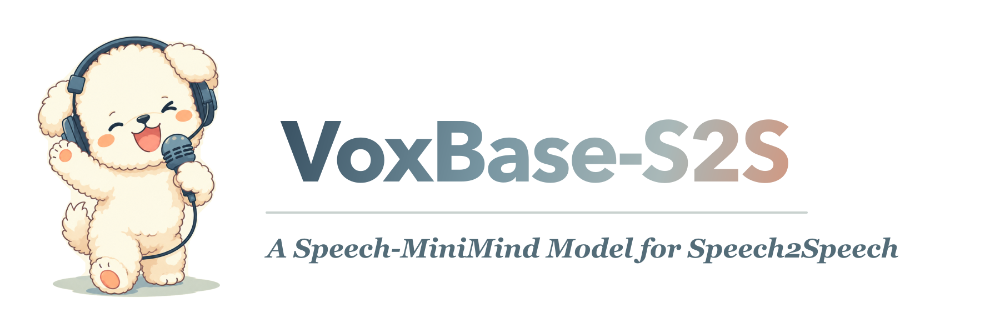
</p>

## 项目定位

> 亲爱的 jingyao 同志的 [MiniMind-O](https://github.com/jingyaogong/minimind-o) 已经以极低的成本，实现了一个融合文本、音频与图像能力的 Omni 模型。不过，在许多实际场景中，我们并不总是需要如此丰富的模态组合；对于只关注语音输入与语音输出的任务，一个专注、轻量的 Speech-to-Speech 系统或许更加直接。因此，我们希望在 MiniMind-O 的基础上进一步探索一条更聚焦的路线，打造 **VoxBase-S2S**：它不仅能够“听懂”音频、理解用户意图，还能够以语音作答，让语音交互更加自然、简洁。
>
> 当然，当前模型仍需配合 **VAD（语音活动检测）** 实现半双工语音交互。如果你希望进一步探索全双工语音交互，欢迎关注并 Star 我的另一个项目 [Full-Duplex-Model](https://github.com/GHJ20001017/Full-Duplex-Model)。

## 项目介绍

之所以同时实现这两条路线，是希望从不同技术路径探索 Speech-to-Speech：路线 A 更易复用成熟的文本 LLM 与 TTS；但由于中间经过了文本这一层，生成的音频难以准确保留原始语音中的语气和情绪。路线 B 则尽量保留语音信息，探索端到端音频建模的可能性。通过并行推进，可以直观比较两种方案在实现成本、语音信息保留和系统能力上的差异。如果你还不了解音频，可以先阅读 [docs/](docs/) 中的分章教程，从语音基础入门，逐步了解音频特征、声学编码器与语音大模型的实现。

### 路线 A：基于文本中间表示的级联架构

<div align="center">
  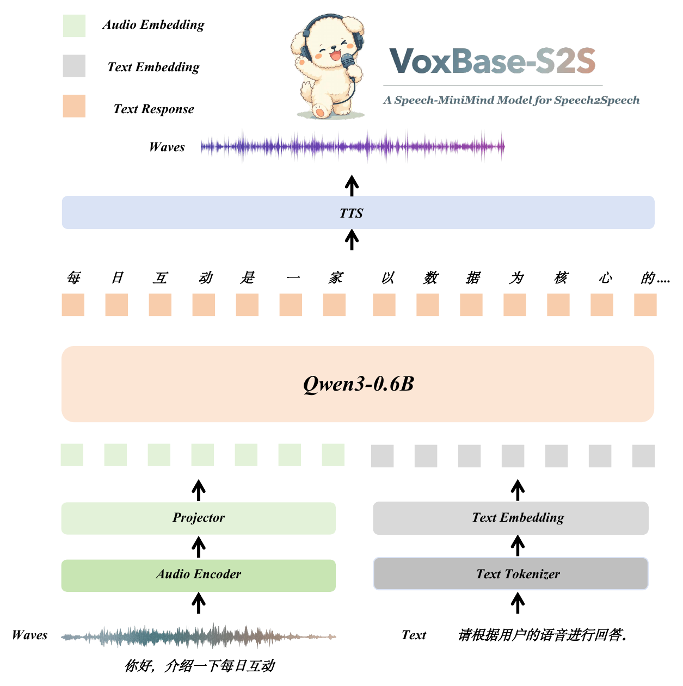
</div>

> **图示说明**：为兼顾模型的泛化能力与训练、部署成本，并更好地支持微调数据集所覆盖的问答任务，本路线未采用 MiniMind 模型作为语言骨干，而是选用参数量较小、具备预训练语言能力的 **Qwen3-0.6B**。
>
> 图中输出汉字与橙色方块逐一对应的画法**仅用于示意**，不代表 Qwen3 的实际分词结果；实际 Token 与汉字并不一定一一对应。

- **语音接入**：通过声学编码器提取输入语音的连续特征，再由 **Projector（投影模块）** 将其映射到通用 LLM 的嵌入空间，与文本提示一起输入模型，无需先将语音转写为文字。声学编码器既可采用本项目训练的 VoxBase-encoder，也可复用预训练的语音编码器。
- **回复生成**：LLM 根据语音特征和文本提示理解用户意图，生成文本回复，再由 **TTS（语音合成）** 将回复转换为语音。
- **优势与局限**：这条路线可复用成熟 LLM 的语言理解与生成能力，以及现有 TTS 的语音合成能力，模块相对独立，便于替换和调试；但仅通过文本将回复传递给 TTS 时，难以完整传递细粒度的语气、韵律和情绪信息，前序模块的错误也可能影响最终的语音回答。

### 路线 B：基于离散语音 Token 的端到端架构

<div align="center">
  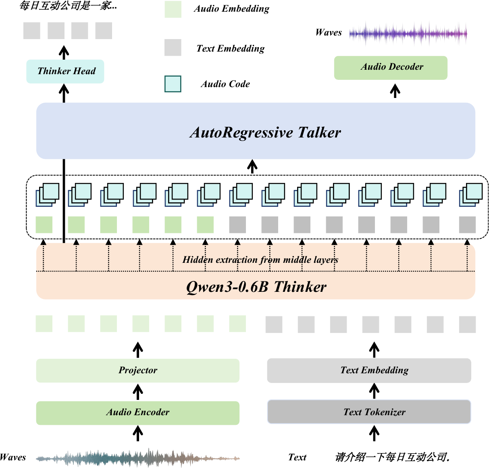
</div>

> **图示说明**：图中结构仅用于概括路线 B 的整体流程，各模块的具体设计与实现细节将在后续展开说明。

- **语音接入**：在图示的整体设计中，输入语音先由 **Audio Encoder（音频编码器）** 提取特征，再经 **Projector（投影模块）** 映射到 **Qwen3-0.6B Thinker** 的嵌入空间，与文本输入一起参与语义理解，无需先将语音转写为文字。
- **回复生成**：Thinker 负责语义建模与文本回复生成，独立的 **Talker（语音生成模块）** 结合 Thinker 的中间层隐藏状态和已生成的音频历史，自回归预测多码本的离散语音 Token，再由 **Audio Decoder（音频解码器）** 将其还原为语音波形。与路线 A 不同，语音生成不再仅依赖最终的文本回复，而是直接利用模型内部的语义表示。
- **优势与局限**：这条路线将语义建模与语音生成更紧密地结合，为联合学习回复内容、韵律和表达方式提供了空间，但并不意味着语音信息能够无损保留。相比独立串接 LLM 与 TTS，联合训练对文本与语音配对数据、音文对齐和多码本生成的稳定性提出了更高要求，训练与调试也更复杂。

## 路线 A：基于文本中间表示的级联架构

### 环境安装

```bash
conda create -n speech-llm python=3.11
conda activate speech-llm
python -m pip install -r requirements.txt
```

### 音频入门：从可视化认识语音（如已熟悉音频，可跳过）

```bash
python scripts/analyze_audio.py examples/disgusted_to_happy.wav \
  --plot outputs/example.png --stft-plot outputs/stft.png --stft-gif outputs/stft_process.gif
```

### 数据集

```bash
python -m pip install modelscope

# 1) 声学编码器（02）用的 manifest 与字符词表：下载主仓库，再把 processed.tar.gz 解压到 data/aishell1/
python -c "from modelscope.hub.snapshot_download import snapshot_download; snapshot_download('ghjghj1017/Tiny_Conformer', local_dir='outputs/Tiny_Conformer')"
mkdir -p data/aishell1
tar -xzf outputs/Tiny_Conformer/processed.tar.gz -C data/aishell1

# 2) AISHELL-1 原始音频（约 15G，支持断点续传），下载并解压到 data/aishell1/data_aishell/
python scripts/download_aishell1.py

# 3) Stage 2 已整理数据：COIG-CQIA、COIG 人类价值观、COIG 翻译、Firefly
#    下载到 data/speech2text_corpus/，包含 stage2_no_aishell.jsonl 及音频目录
python scripts/download_stage2_data.py

# 完成第 2 节的 stage 2 清单下载与切分后执行
python scripts/resample_stage2_mixed.py --data data/speech2text_corpus/splits --splits train,val,test --sr 16000
```

#### 数据集组成

**Stage 1：语音转写数据**

Stage 1 仅使用 AISHELL-1。所有样本都采用固定指令「请转写为中文」，目标答案为对应的转写文本，并沿用 AISHELL-1 的官方 `train` / `dev` / `test` 划分，不再额外切分。VoxBase-encoder 读取 `data/aishell1/processed/` 下的 CSV，Speech Projector（第 5 节）读取 `data/speech2text_corpus/stage1_aishell/` 下的 JSONL。两者使用的是同一批音频，只是存储格式不同。

**Stage 2：语音问答与指令数据**

Stage 2 使用 AISHELL-1 之外的自然问答和指令数据，用于第 8 节的指令微调。不同来源的数据经过筛选、去重和格式整理后，统一组织为逐行样本。每条样本包含 `prompt`、`wav` 和 `answer` 等字段；其中 `prompt` 仅用于通过 TTS 合成问题音频，训练第 8 节时实际读取的是 `wav` 和 `answer`，不会将 `prompt` 作为文本输入。所有样本使用固定系统提示词：「你是一个语音助手，根据用户的音频内容回答用户的问题」。

| 来源 | 保留内容 | 语言 | 音频 |
|---|---|---|---|
| COIG 人类价值观 | instruction/output 问答 | zh | 文本，需 TTS |
| Firefly OpenQA + Dictionary | 开放问答、词典解释 | zh | 文本，需 TTS |
| COIG-CQIA | 仅高质量子集 | zh | 文本，需 TTS |
| COIG 翻译指令 | 仅高质量中文子集 | zh | 文本，需 TTS |
| moss_speech_qa | 仅首轮问答 | zh | 已合成音频 |

### 训练VoxBase-encoder（Tiny Conformer + CTC）

<p align="center">
  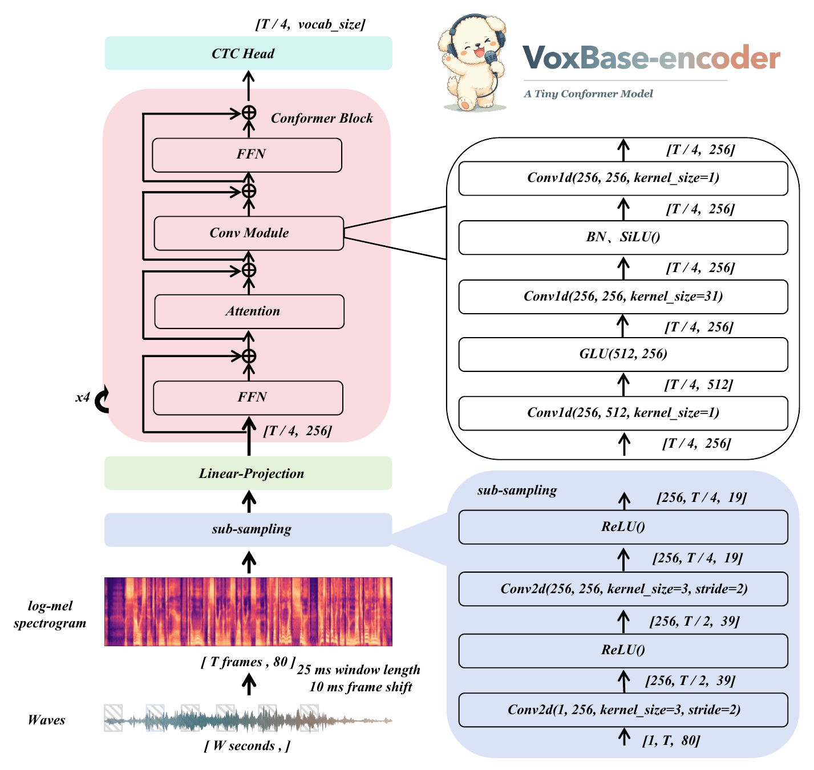
</p>

> **图示说明**：上图展示了非流式 Conformer 声学编码器的整体结构。非流式模式以完整语音片段为输入，处理当前帧时可以利用前后文，包括未来的声学特征，因此卷积和注意力模块能够在更完整的上下文中提取信息。流式模式则需要边接收音频边进行识别，当前时刻只能访问已经到达的历史特征和有限的当前特征，不能直接使用未来信息。为满足实时性，流式版本通常需要在卷积、注意力等模块中引入因果约束、分块计算或缓存机制，这会对模型结构、上下文范围和识别延迟产生一定影响。

#### 非流式训练

```bash
CUDA_VISIBLE_DEVICES=0,1,2,3 torchrun --nproc_per_node=4 trainer/train_conformer_ctc.py \
  --data data/aishell1/processed --epochs 20 --batch-size 32 --lr 2e-4
```

#### 流式训练

```bash
CUDA_VISIBLE_DEVICES=0,1,2,3 torchrun --nproc_per_node=4 trainer/train_conformer_streaming_ctc.py \
  --data data/aishell1/processed --epochs 20 --batch-size 32 --lr 2e-4 \
  --chunk-size 32 --left-context 16
```


下面给出训练过程中的CTC loss 曲线（仅供参考）：

| train/ctc_loss_step | dev/ctc_loss |
|:---:|:---:|
| 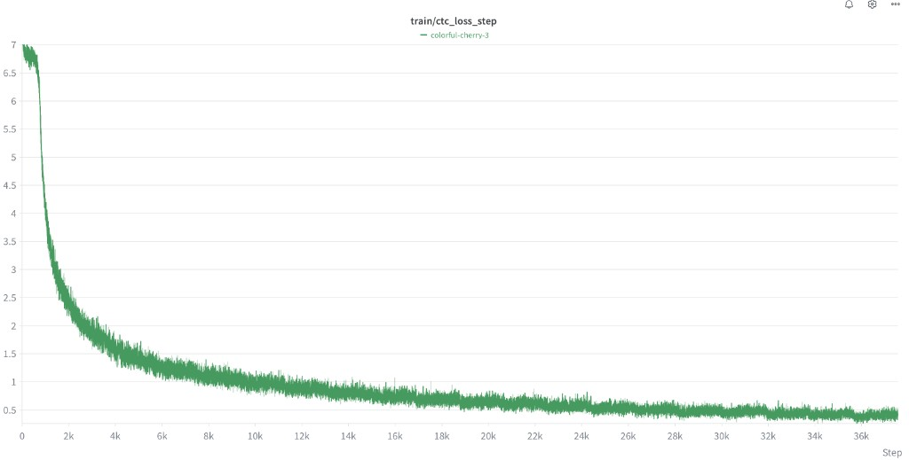 | 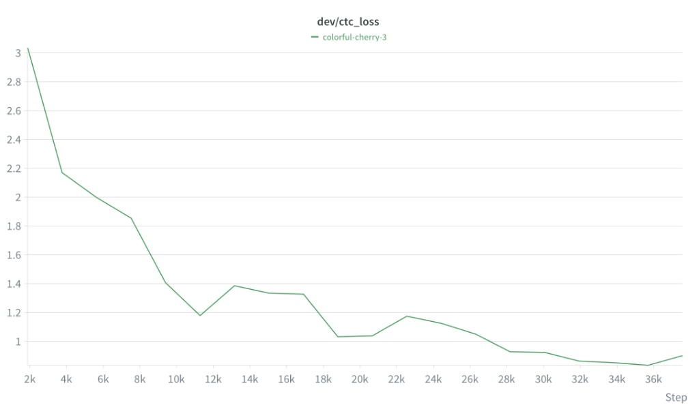 |


### 评估VoxBase-encoder

```bash
# 一键报告：dev/test CER、checkpoint 对比、样例、RTF
python scripts/evaluate_conformer_report.py \
  --data data/aishell1/processed --output outputs/02_acoustic_encoder --split both
```

### WebUI 流式 vs 非流式演示

在 Gradio 中选择「ASR 转写（Conformer）」，并排查看非流式整句结果与因果流式增量结果。上传或录制完整音频后点击「开始」：

```bash
python scripts/visualize_asr_webui.py \
  --checkpoint outputs/02_acoustic_encoder/tiny_conformer_ctc.pt \
  --stream-checkpoint outputs/02_streaming_acoustic_encoder/tiny_streaming_conformer_ctc.pt \
  --audio path/to/long.wav
```

<p align="center">
  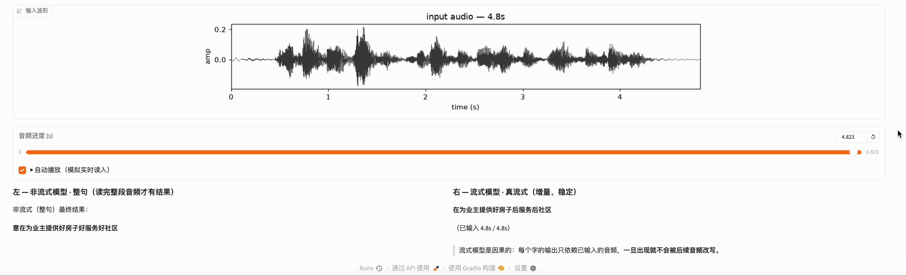
</p>

> **关于本套编码器的泛化性声明**：VoxBase-encoder只在**中文 AISHELL-1**（16kHz 平稳播音、整句 2–6s）上训练，且**模型参数量较小**（约 Tiny 规模），因此对**训练分布外的输入难以有较好的泛化性能**——例如带口音/方言、语速异常、嘈杂或更长的音频，识别效果会明显下降甚至出现乱码。这属于预期行为，并非代码 bug；如果你需要更通用、更强的声学编码，**建议用开源的成熟编码器**（如 FunASR 的 Paraformer-zh-streaming、Whisper/OpenAI、语音自监督前端 wav2vec 2.0 / HuBERT 等）来达到更好的效果，本项目的编码器更多用于教学演示与完整流水线打通。

训练好的VoxBase-encoder权重（流式与非流式）会发布在 ModelScope 仓库：https://www.modelscope.cn/models/ghjghj1017/Tiny_Conformer。

### 换用成熟开源编码器（推荐 FunASR / SenseVoice-Small）

如果后续要换成开源的成熟声学编码器，**推荐用 FunASR 的 SenseVoice-Small**。它是离线非自回归模型，适合批量提取帧级 encoder hidden states。首次使用时安装依赖并下载模型：

```bash
# 默认可由 FunASR 自动下载；也可提前下载到本地目录
python -c "from modelscope.hub.snapshot_download import snapshot_download; snapshot_download('iic/SenseVoiceSmall', local_dir='outputs/sensevoice-small')"
```

### 训练Projector

使用 **SenseVoice-Small 作为冻结编码器**。

```bash
CUDA_VISIBLE_DEVICES=0,1,2,3 torchrun --nproc_per_node=4 trainer/train_speech_projector.py \
  --data data/speech2text_corpus/stage1_aishell \
  --encoder-type sensevoice \
  --sensevoice-model outputs/sensevoice-small \
  --qwen3-model /gpu3/guhj/models/Qwen3-0.6B \
  --output outputs/03_speech_qwen3_projector --epochs 5 --batch-size 2 \
  --lr-schedule cosine --warmup-ratio 0.03 --min-lr-ratio 0.1 --loss-ema 0.02 \
  --wandb --wandb-name projector_qwen3_sensevoice
```

下面给出训练过程中的loss 曲线（仅供参考）：

| train/loss_step | dev/loss |
|:---:|:---:|
| 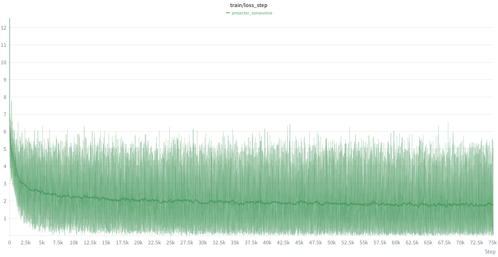 | 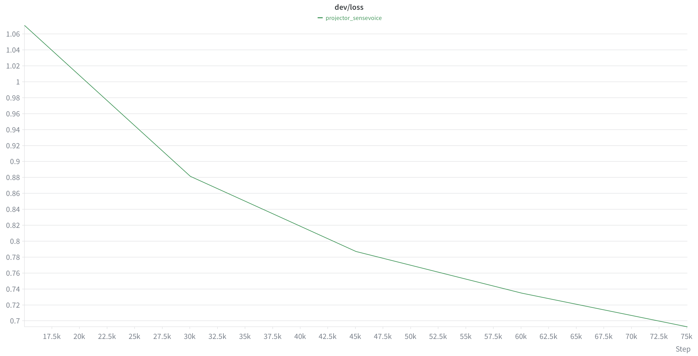 |

### 指令微调VoxBase-S2S

在预训练 Projector 的基础上，以下配置对 **Qwen3-0.6B 进行全参数微调**，并以独立学习率同步训练 Projector，使模型能够理解语音输入并生成文本回答。完成「数据集」部分的 Stage 2 数据准备与重采样后，即可开始训练：

```bash
# Projector 与 Qwen3 一起训练；--projector-lr 是 Projector 的独立小学习率
CUDA_VISIBLE_DEVICES=0,1,2,3 torchrun --nproc_per_node=4 trainer/train_speech_qwen3.py \
  --data data/speech2text_corpus/splits \
  --encoder-type sensevoice --sensevoice-model outputs/sensevoice-small \
  --projector-checkpoint outputs/03_speech_qwen3_projector/projector_epoch_005.pt \
  --qwen3-model /gpu3/guhj/models/Qwen3-0.6B \
  --output outputs/04_speech_qwen3_sft --epochs 3 --batch-size 2 \
  --tune full --tune-projector --projector-lr 5e-5 \
  --lr-schedule cosine --warmup-ratio 0.03 --min-lr-ratio 0.1 --loss-ema 0.02 \
  --wandb --wandb-name speech_qwen3_sft
```

下面给出训练过程中的loss 曲线（仅供参考）：

| train/loss_step（跨卡平均） | dev/loss |
|:---:|:---:|
| 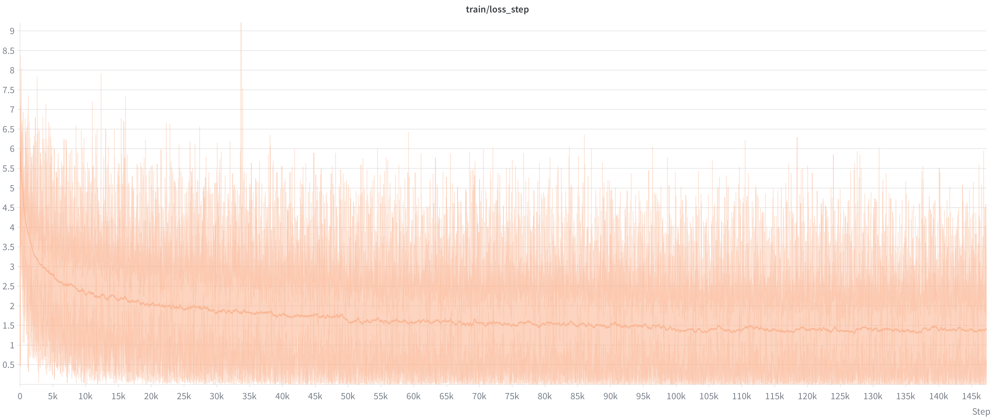 | 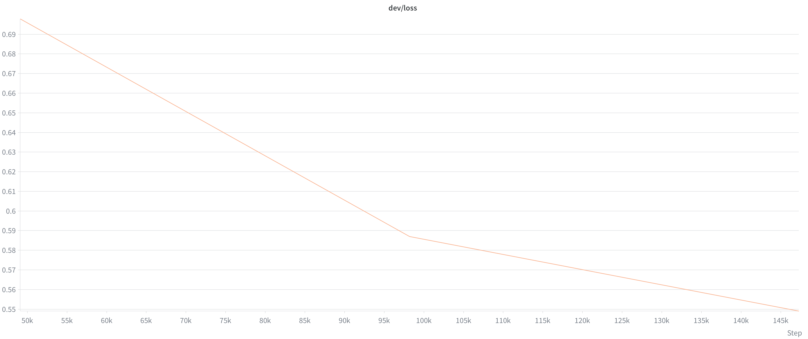 |

### 模型效果与交互体验

#### 语音问答效果示例

| # | 问题 | speech-minimind |
| --- | --- | --- |
| 1 | 简述商业秘密的构成要件 | “商业秘密的构成要件包括：(1)权利主体是自然人或法人。(2)权利客体是商业秘密。(3)权利内容是商业秘密的保密性。(4)权利内容具有排他性。(5)权利内容具有独占性。(6)权利内容具有时间上的限制性。(7)权利内容具有排他性。” |
| 2 | 好莱坞选择东方文化背景时，为什么更偏重日本？ | “因为日本的建筑风格和中国建筑风格不一样，所以中国建筑风格的元素在日式建筑中会显得更加突出。” |
| 3 | “目不知书”的含义是什么？ | “指不识字。 成语出处：无” |

#### Gradio 互动平台

在 Gradio 界面选择「音频问答」模式，根据音频内容生成回答，并通过 Qwen3-TTS 分句合成、按顺序流式播放。

```bash
# 同时启用语音识别、音频问答与流式语音回答
python scripts/visualize_asr_webui.py \
  --checkpoint outputs/02_acoustic_encoder/tiny_conformer_ctc.pt \
  --encoder-type sensevoice \
  --sensevoice-model outputs/sensevoice-small \
  --projector-checkpoint outputs/04_speech_qwen3_sft/projector_epoch_003.pt \
  --qwen3-model outputs/04_speech_qwen3_sft/model_epoch_003 \
  --instruction "你是一个语音助手，根据用户的音频内容回答用户的问题" \
  --tts-model /gpu3/guhj/models/Qwen3-TTS-12Hz-1.7B-CustomVoice \
  --tts-speaker Serena \
  --host 0.0.0.0 --port 7861 --ssl-auto
```

<p align="center">
  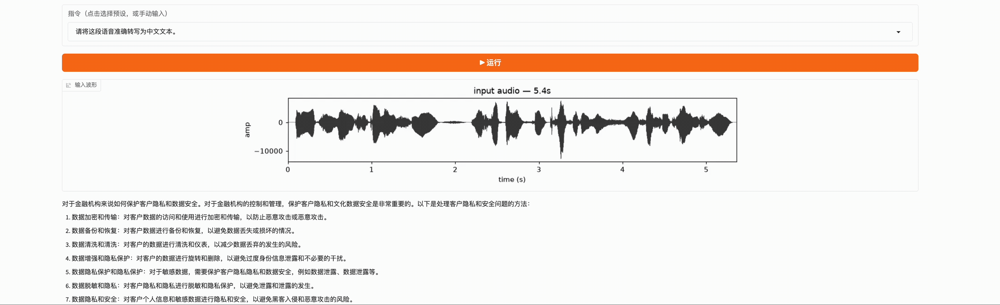
</p>

## 路线 B：基于离散语音 Token 的端到端架构

### 构建训练数据

从 ModelScope 下载 MiniMind-O 已经 token 化好的 `sft_t2a.parquet` 和 `sft_a2a.parquet`，分别用于 S2A 训练和语音到语音数据准备：

```bash
# 下载 S2A 训练数据
python -c "from modelscope.hub.snapshot_download import dataset_snapshot_download; dataset_snapshot_download('gongjy/minimind-o_dataset', local_dir='data/minimind_o', allow_patterns=['sft_t2a.parquet'])"

# 下载并准备语音到语音数据
python scripts/prepare_speech_to_speech.py --download \
  --file-name sft_a2a.parquet --lang zh \
  --output data/route_b/s2s --device cuda:0
```

### 训练语音生成能力

该阶段以文本问题作为输入，以文本答案及其对应的语音作为训练目标，让模型学习在生成回答内容的同时生成相应的语音。如下图所示，Thinker 负责理解问题并生成文本回答，Talker 则结合 Thinker 的隐藏表示，自回归预测离散语音 Token，再由冻结的音频解码器将其还原为可播放的波形。通过文本与语音的联合训练，模型学习回答内容与语音表达之间的对应关系，从而不仅能用文字作答，也能将答案“说”出来。

<p align="center">
  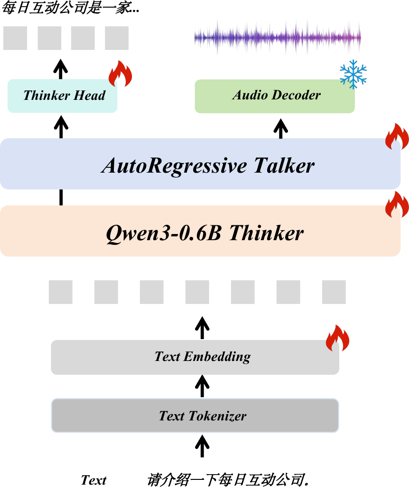
</p>

用以下命令开始训练语音生成能力：

```bash
cd /gpu3/guhj/Speech-MiniMind
CUDA_VISIBLE_DEVICES=6,7 HF_HUB_OFFLINE=1 TRANSFORMERS_OFFLINE=1 \
/gpu3/guhj/envs/speech-llm/bin/python -m torch.distributed.run \
  --nproc_per_node=2 --master-port=29523 \
  trainer/train_audio_multitask.py \
  --data data/minimind_o/sft_t2a.parquet \
  --qwen3-model /gpu3/guhj/models/Qwen3-0.6B \
  --output outputs/s2a_thinker_talker_loss_metrics \
  --task s2a --stage-index 1 --talker-layers 4 --max-seq-len 512 \
  --epochs 5 --batch-size 8 --grad-accum-steps 4 \
  --lr 2e-5 --audio-lr 2e-4 \
  --lr-schedule cosine --warmup-ratio 0.1 --min-lr-ratio 0.1 \
  --history-noise-prob 0.05 --loss-chunk 256 --grad-clip 1.0 --loss-ema 0.02 \
  --num-workers 0 --seed 7 --limit 0 --dev-limit 0 \
  --wandb --wandb-project Speech-MiniMind --wandb-name s2a_thinker_talker_loss_metrics
```

### 4. 语音到语音指令微调（06，B1/B2）

从已训练的 B0 checkpoint 继续做 **LoRA 微调**，冻结音频 embedding、LM head 和主干原始权重，只监督回答语音段（prompt / 输入音频 / padding 全部 `-100`）。LoRA 覆盖 Attention 的 Q/K/V/O 与 MLP 的 gate/up/down 投影。

下面是在 95 服务器项目目录下执行的完整命令；直接指定 `speech-llm` 环境，输出单独放在 `06_route_b_s2s_lora`，避免覆盖已有全参训练结果：

```bash
cd /gpu3/guhj/Speech-MiniMind
CUDA_VISIBLE_DEVICES=6,7 \
/gpu3/guhj/envs/speech-llm/bin/python -m torch.distributed.run \
  --nproc_per_node=2 --master-port=29522 \
  trainer/train_speech_to_speech.py \
  --data data/route_b/s2s \
  --init-from outputs/05_route_b_audio_lm_emilia/model_epoch_003 \
  --output outputs/06_route_b_s2s_lora --epochs 3 --batch-size 2 \
  --tune lora --lora-r 16 --lora-alpha 32 --lora-dropout 0.05 \
  --lr 1e-4 --num-workers 4 --grad-checkpointing --loss-chunk 256 \
  --lr-schedule cosine --warmup-ratio 0.03 --min-lr-ratio 0.1 --loss-ema 0.02 \
  --wandb --wandb-name route_b_s2s_lora
```

### 5. 端到端推理（06）

```bash
python scripts/infer_speech_to_speech.py \
  --audio examples/disgusted_to_happy.wav \
  --model outputs/06_route_b_s2s_lora/model_epoch_003 \
  --codec-type mimi --device cuda:0 --output outputs/route_b_answer.wav
```

> codec 为冻结的预训练模型（Mimi 8×2048、12.5 Hz、24 kHz；EnCodec 24 kHz 作对照），仓库不训练 codec。第一阶段的 s2s 数据主要来自 MiniMind-O `sft_a2a` 与自建 TTS 合成配对，**音色单一、无真实噪声**，属于教学闭环的已知局限，不能当作真实场景泛化结论。


## 目录结构

```text
Speech-MiniMind/
├── docs/        # 分章教学文档
├── assets/      # README 插图（训练曲线等）
├── examples/    # 示例音频
├── model/       # Conformer、CTC、流式版、Projector、Qwen3 适配（qwen3_adapter.py）、chat 模板（chat_format.py）、音频 codec / 音频 LM（路线 B）
├── dataset/     # Dataset 与训练时随机音频增强（含路线 B 的 token 数据集）
├── trainer/     # 各阶段训练脚本
├── scripts/     # 数据准备 / 下载 / 评估 / 推理 / WebUI
├── data/        # 本地数据，不提交
├── outputs/     # 图表、日志、checkpoint，不提交
├── requirements.txt
└── README.md
```

## 开源说明

数据集遵循 AISHELL-1 原始许可；`data/`、`outputs/`、`.pt`、压缩包不提交仓库。正式发布前会补充代码许可证与数据集引用。