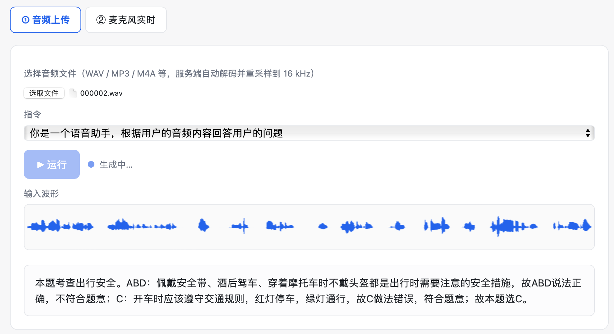

## 项目定位

> 亲爱的 jingyao 同志的 [MiniMind-O](https://github.com/jingyaogong/minimind-o) 已经以极低的成本，实现了一个融合文本、音频与图像能力的 Omni 模型。不过，在许多实际场景中，我们并不总是需要如此丰富的模态组合；对于只关注语音输入与语音输出的任务，一个专注、轻量的 Speech-to-Speech 系统或许更加直接。因此，我们希望在 MiniMind-O 的基础上进一步探索一条更聚焦的路线，打造 **VoxBase-S2S**：它不仅能够“听懂”音频、理解用户意图，还能够以语音作答，让语音交互更加自然、简洁。
>
> 当然，当前模型仍需配合 **VAD（语音活动检测）** 实现半双工语音交互。如果你希望进一步探索全双工语音交互，欢迎关注并 Star 我的另一个项目 [Full-Duplex-Model](https://github.com/GHJ20001017/Full-Duplex-Model)。

## 项目介绍

之所以同时实现这两条路线，是希望从不同技术路径探索 Speech-to-Speech：路线 A 更易复用成熟的文本 LLM 与 TTS；但由于中间经过了文本这一层，生成的音频难以准确保留原始语音中的语气和情绪。路线 B 则尽量保留语音信息，探索端到端音频建模的可能性。通过并行推进，可以直观比较两种方案在实现成本、语音信息保留和系统能力上的差异。如果你还不了解音频，可以先阅读 [docs/](docs/) 中的分章教程，从语音基础入门，逐步了解音频特征、声学编码器与语音大模型的实现。

### 路线 A：基于文本中间表示的级联架构

<div align="center" style="display: flex !important; justify-content: center !important; width: 100%; text-align: center;">
  
</div>

> **图示说明**：为兼顾模型的泛化能力与训练、部署成本，并更好地支持微调数据集所覆盖的问答任务，本路线未采用 MiniMind 模型作为语言骨干，而是选用参数量较小、具备预训练语言能力的 **Qwen3-0.6B**。
>
> 图中输出汉字与橙色方块逐一对应的画法**仅用于示意**，不代表 Qwen3 的实际分词结果；实际 Token 与汉字并不一定一一对应。

- **语音接入**：通过声学编码器提取输入语音的连续特征，再由 **Projector（投影模块）** 将其映射到通用 LLM 的嵌入空间，与文本提示一起输入模型，无需先将语音转写为文字。声学编码器既可采用本项目训练的 VoxBase-encoder，也可复用预训练的语音编码器。
- **回复生成**：LLM 根据语音特征和文本提示理解用户意图，生成文本回复，再由 **TTS（语音合成）** 将回复转换为语音。
- **优势与局限**：这条路线可复用成熟 LLM 的语言理解与生成能力，以及现有 TTS 的语音合成能力，模块相对独立，便于替换和调试；但仅通过文本将回复传递给 TTS 时，难以完整传递细粒度的语气、韵律和情绪信息，前序模块的错误也可能影响最终的语音回答。

### 路线 B：基于离散语音 Token 的端到端架构

```
语音输入 ──► 量化编码器(codebook) ──► 音频专属LLM(Qwen3-0.6B) ──► 解码器 ──► 语音输出
```

- 语音**直接**经过量化编码器生成**codebook**（离散 token 序列），全程音频时域。
- 由**音频专属的 LLM**（同样是 Qwen3-0.6B）在 token 序列上建模、理解并生成。
- 生成的 codebook 再经**解码器**还原为波形，端到端输出语音。
- 优点：语音信息无文本有损，更接近"听"的本质；缺点是需专用数据与更大的训练成本。

> 两条路线共享同一份**语音理解**基础，可并行演进、互为对照。以下文档先按**路线 A** 搭建教学主线。

```text
00 语音基础 → 01 Mel 频谱 → 02 声学编码器（Tiny Conformer + CTC，含流式版） → 03 接入 Qwen3-0.6B → 04 指令微调语音 LLM
```

## 路线 A：级联式 Speech LLM 端到端实现（教学主线）

下面从环境准备到最终微调，把**路线 A** 完整走一遍：编码器 → Projector → 指令微调语音 LLM →（文本回答，可接 TTS 输出语音）。

### 环境安装

```bash
conda create -n speech-llm python=3.11
conda activate speech-llm
python -m pip install -r requirements.txt
```

### 1. 语音分析（00/01）

对示例音频生成波形、频谱、STFT 动画：

```bash
python scripts/analyze_audio.py examples/disgusted_to_happy.wav \
  --plot outputs/example.png --stft-plot outputs/stft.png --stft-gif outputs/stft_process.gif
```

### 2. 数据集

本项目后续训练用到的数据集都统一放在 **ModelScope** 上：编码器用的 manifest、stage-1 转写语料与编码器权重都在主仓库；只有体量最大的 AISHELL-1 **原始音频**因为太大，改用 `scripts/download_aishell1.py` 从 ModelScope 镜像下载。

- 主仓库（AISHELL-1 `processed` manifest/vocab、stage-1 转写语料、编码器权重）：<https://www.modelscope.cn/models/ghjghj1017/Tiny_Conformer>

```bash
python -m pip install modelscope

# 1) 声学编码器（02）用的 manifest 与字符词表：下载主仓库，再把 processed.tar.gz 解压到 data/aishell1/
python -c "from modelscope.hub.snapshot_download import snapshot_download; snapshot_download('ghjghj1017/Tiny_Conformer', local_dir='outputs/Tiny_Conformer')"
mkdir -p data/aishell1
tar -xzf outputs/Tiny_Conformer/processed.tar.gz -C data/aishell1

# 2) AISHELL-1 原始音频（约 15G，支持断点续传），下载并解压到 data/aishell1/data_aishell/
python scripts/download_aishell1.py
```

#### 2.1 数据集组成

**stage 1** —— 只含 AISHELL-1，指令固定为「请转写为中文」，答案就是转写文本。按 AISHELL-1 **官方划分**拆成 `train` / `dev` / `test`，训练时不再切分。声学编码器（第 3/4 节）读 `data/aishell1/processed/` 的 CSV，Speech Projector（第 5 节）读 `data/speech2text_corpus/stage1_aishell/` 的 JSONL；两者记录的是同一批音频，只是格式不同。

| 划分 | 行数 | 用途 |
|---|---:|---|
| train | 120098 | 第 3/4 节声学编码器（`processed/train.csv`）、第 5 节 Speech Projector（`stage1_aishell/train.jsonl`） |
| dev | 14326 | 编码器开发集；Projector 与 test 合并为验证集 |
| test | 7176 | 编码器测试集；Projector 与 dev 合并为验证集 |

**stage 2** —— AISHELL-1 之外的全部自然问答 / 指令数据，统一为同一行格式，用于第 8 节指令微调 Speech LLM。每行仍带 `prompt`，但**训练第 8 节时只读取 `wav` 与 `answer`**（`prompt` 供 TTS 合成问题音频用，不再作为文本输入），统一配固定系统提示词「你是一个语音助手，根据用户的音频内容回答用户的问题」。由以下来源筛选、去重、统一格式后合成：

| 来源 | 保留内容 | 语言 | 音频 |
|---|---|---|---|
| COIG 人类价值观 | instruction/output 问答 | zh | 文本，需 TTS |
| Firefly OpenQA + Dictionary | 开放问答、词典解释 | zh | 文本，需 TTS |
| COIG-CQIA | 仅高质量子集 | zh | 文本，需 TTS |
| COIG 翻译指令 | 仅高质量中文子集 | zh | 文本，需 TTS |
| moss_speech_qa | 仅首轮问答 | zh | 已合成音频 |
| VoiceAssistant-400K | 全部保留 | en | 原始音频 |

#### 2.2 本地目录布局

下载后把数据放到 `data/` 下，训练脚本按下列路径读取：

```text
data/
├── aishell1/
│   ├── data_aishell/            # 原始音频（wav/、transcript/、resource_aishell/），download_aishell1.py 下载
│   └── processed/               # 第 3/4 节编码器读取，来自 ModelScope 的 processed.tar.gz
│       ├── train.csv            # 表头 path,text
│       ├── dev.csv
│       ├── test.csv
│       └── vocab.txt            # 字符词表，首行 <blank>，其后每行一个汉字
└── speech2text_corpus/
    ├── stage1_aishell/          # 第 5 节 Projector 读取，由 aishell-1/*.parquet 转出
    │   ├── train.jsonl          # AISHELL-1 官方 train 划分
    │   ├── dev.jsonl
    │   └── test.jsonl
    └── splits/                  # 第 8 节 Speech LLM 读取（stage 2，按来源分层切分）
        ├── train.jsonl
        ├── val.jsonl
        └── test.jsonl
```

### 3. 训练中文声学编码器（02，Tiny Conformer + CTC）


#### 非流式（离线整句识别）

```bash
CUDA_VISIBLE_DEVICES=0,1,2,3 torchrun --nproc_per_node=4 trainer/train_conformer_ctc.py \
  --data data/aishell1/processed --epochs 20 --batch-size 32 --lr 2e-4
```

输出到 `outputs/02_acoustic_encoder/`：`metrics.csv`、`loss_curve.png`、逐 epoch checkpoint、`tiny_conformer_ctc.pt`。

#### 流式（chunk-based 因果版）

同一编码器任务的流式实现，用于边听边出的实时场景：

+ **模型**：`model/conformer_streaming.py`（因果下采样、因果卷积、分块因果注意力 + 左上下文缓存）、`model/ctc_streaming.py`（流式 CTC 封装）
+ **训练**：

```bash
CUDA_VISIBLE_DEVICES=0,1,2,3 torchrun --nproc_per_node=4 trainer/train_conformer_streaming_ctc.py \
  --data data/aishell1/processed --epochs 20 --batch-size 32 --lr 2e-4 \
  --chunk-size 32 --left-context 16
```


训练过程（AISHELL-1，约 37k step）的 CTC loss 曲线：

| train/ctc_loss_step | dev/ctc_loss |
|---|---|
|  |  |

train loss 从约 7 收敛到约 0.5；dev loss 从约 3.0 稳定下降到约 0.9。

### 4. 评估声学编码器（02）

```bash
# 一键报告：dev/test CER、checkpoint 对比、样例、RTF
python scripts/evaluate_conformer_report.py \
  --data data/aishell1/processed --output outputs/02_acoustic_encoder --split both

# 单 checkpoint 评估
python scripts/evaluate_conformer_ctc.py \
  --data data/aishell1/processed \
  --checkpoint outputs/02_acoustic_encoder/checkpoint_epoch_020.pt --split dev
```

同目录还有 `scripts/plot_training_metrics.py` 可绘制训练曲线。

### WebUI 流式 vs 非流式演示

运行 `scripts/visualize_asr_webui.py`（Gradio）可视化 02 章声学编码器，左右对比非流式（整句）与流式（增量）识别效果：

```bash
python -m pip install gradio   # 首次需要

python scripts/visualize_asr_webui.py \
  --checkpoint outputs/02_acoustic_encoder/tiny_conformer_ctc.pt \
  --stream-checkpoint outputs/02_streaming_acoustic_encoder/tiny_streaming_conformer_ctc.pt \
  --audio path/to/long.wav
```

> 两侧模型 checkpoints **不可互换**（下采样与卷积结构不同）：非流式用 `outputs/02_acoustic_encoder/` 训练的权重，流式侧需显式传入 `--stream-checkpoint` 才会启用。只演示一侧时省略对应参数即可（`pip install gradio` 首次安装）。启动后访问 `http://0.0.0.0:7860`。


> **关于本套编码器的泛化性声明**：我们的 Tiny Conformer + CTC 编码器只在**中文 AISHELL-1**（16kHz 平稳播音、整句 2–6s）上训练，且**模型参数量较小**（约 Tiny 规模），因此对**训练分布外的输入难以有较好的泛化性能**——例如带口音/方言、语速异常、嘈杂或更长的音频，识别效果会明显下降甚至出现乱码。这属于预期行为，并非代码 bug；如果你需要更通用、更强的声学编码，**建议用开源的成熟编码器**（如 FunASR 的 Paraformer-zh-streaming、Whisper/OpenAI、语音自监督前端 wav2vec 2.0 / HuBERT 等）来达到更好的效果，本项目的编码器更多用于教学演示与完整流水线打通。

我们训练好的 02 章「Tiny Conformer + CTC」编码器权重（**流式**与**非流式**）会发布在 ModelScope 仓库：<https://www.modelscope.cn/models/ghjghj1017/Tiny_Conformer>。你可以直接下载使用，省去本地重新训练。

### 换用成熟开源编码器（推荐 FunASR / SenseVoice-Small）

如果后续要换成开源的成熟声学编码器，**推荐用 FunASR 的 SenseVoice-Small**。它是离线非自回归模型，适合批量提取帧级 encoder hidden states。首次使用时安装依赖并下载模型：

```bash
# 默认可由 FunASR 自动下载；也可提前下载到本地目录
python -c "from modelscope.hub.snapshot_download import snapshot_download; snapshot_download('iic/SenseVoiceSmall', local_dir='outputs/sensevoice-small')"
```

### 5. 训练语音投影器连接 Qwen3-0.6B（03，Speech Projector）

使用 **SenseVoice-Small 作为冻结编码器**。`train_speech_projector.py` 读第 2 节下载的 stage-1 目录 `data/speech2text_corpus/stage1_aishell/`（内含 `train.jsonl` / `dev.jsonl` / `test.jsonl`，每行 `{"wav": "...", "prompt": "请转写为中文", "answer": "..."}`），因此先确认第 2 节的数据集已放好，再准备 [Qwen3-0.6B](https://huggingface.co/Qwen/Qwen3-0.6B) 权重（本项目在 95 上放在 `/gpu3/guhj/models/Qwen3-0.6B`）：

```bash
CUDA_VISIBLE_DEVICES=0,1,2,3 torchrun --nproc_per_node=4 trainer/train_speech_projector.py \
  --data data/speech2text_corpus/stage1_aishell \
  --encoder-type sensevoice \
  --sensevoice-model outputs/sensevoice-small \
  --qwen3-model /gpu3/guhj/models/Qwen3-0.6B \
  --output outputs/03_speech_qwen3_projector --epochs 5 --batch-size 2 \
  --lr-schedule cosine --warmup-ratio 0.03 --min-lr-ratio 0.1 --loss-ema 0.02 \
  --wandb --wandb-name projector_qwen3_sensevoice
```

训练过程（AISHELL-1，约 9.5k step）的 loss 曲线：

| train/loss_step | dev/loss |
|---|---|
|  |  |

### 6. 统一 stage 2 音频采样率（`resample_stage2_mixed.py`）

第 2 节下载的 stage 2 切分音频采样率仍不一致（moss_speech_qa 与合成语音的 Qwen3-TTS=24kHz、VoiceAssistant-400K=22050Hz，AISHELL-1=16kHz），而 `train_speech_qwen3.py` 强制 16kHz 输入。用 `resample_stage2_mixed.py` 统一到 16kHz：

```bash
# 第 2 节下载的 stage 2 三份清单
python scripts/resample_stage2_mixed.py --data data/speech2text_corpus/splits --splits train,val,test --sr 16000
```

### 8. 指令微调语音 LLM（04，真正的 Speech-MiniMind）

在第 5 节的 Projector 桥接基础上，**微调整个 Qwen3-0.6B**（LoRA 或全参），并以较小学习率同步训练 Projector，让它变成能听语音、生成回答的完整 Speech LLM。

> 0.6B 全参微调对学习率比 64M 模型敏感得多：`--tune full` 建议用脚本默认的 `--lr 2e-5`，`--tune lora` 用默认的 `--lr 2e-4`。LoRA 覆盖不到 `embed_tokens`，两个 audio marker 的 embedding 行会一直保持初始化值；需要它们一起学就用 `--tune full`。

数据侧把第 2 节下载的 stage 2 切分和第 6 节的重采样做完即可：

```bash
# Projector 与 Qwen3 一起训练；--projector-lr 是 Projector 的独立小学习率
CUDA_VISIBLE_DEVICES=0,1,2,3 torchrun --nproc_per_node=4 trainer/train_speech_qwen3.py \
  --data data/speech2text_corpus/splits \
  --encoder-type sensevoice --sensevoice-model outputs/sensevoice-small \
  --projector-checkpoint outputs/03_speech_qwen3_projector/projector_epoch_005.pt \
  --qwen3-model /gpu3/guhj/models/Qwen3-0.6B \
  --output outputs/04_speech_qwen3_sft --epochs 3 --batch-size 2 \
  --tune full --tune-projector --projector-lr 5e-5 \
  --lr-schedule cosine --warmup-ratio 0.03 --min-lr-ratio 0.1 --loss-ema 0.02 \
  --wandb --wandb-name speech_qwen3_sft
```

训练过程（stage 2 中文切分 91,490 行，4 卡约 5.7k step/epoch）的 loss 曲线：

| train/loss_step（跨卡平均） | dev/loss |
|---|---|
|  |  |

train loss 从约 8 收敛到约 0.85；dev loss 稳定下降到约 0.58。

### 9. 评估与测试指令微调模型（离线指标 / 推理 / WebUI）

#### 问答示例

| # | 问题 | speech-minimind |
| --- | --- | --- |
| 1 | 简述商业秘密的构成要件 | “商业秘密的构成要件包括：(1)权利主体是自然人或法人。(2)权利客体是商业秘密。(3)权利内容是商业秘密的保密性。(4)权利内容具有排他性。(5)权利内容具有独占性。(6)权利内容具有时间上的限制性。(7)权利内容具有排他性。” |
| 2 | 好莱坞选择东方文化背景时，为什么更偏重日本？ | “因为日本的建筑风格和中国建筑风格不一样，所以中国建筑风格的元素在日式建筑中会显得更加突出。” |
| 3 | “目不知书”的含义是什么？ | “指不识字。 成语出处：无” |

#### WebUI 互动平台（FastAPI + WebSocket，双模式）

```bash
python -m pip install fastapi uvicorn soundfile qwen-tts   # 首次需要

# 局域网访问 + 麦克风 + Qwen3 文本回答转语音
python scripts/visualize_speech_qwen3_webui.py \
  --encoder-type sensevoice \
  --sensevoice-model outputs/sensevoice-small \
  --projector-checkpoint outputs/04_speech_qwen3_sft/projector_epoch_003.pt \
  --qwen3-model outputs/04_speech_qwen3_sft/model_epoch_003 \
  --instruction "你是一个语音助手，根据用户的音频内容回答用户的问题" \
  --tts-model /gpu3/guhj/models/Qwen3-TTS-12Hz-1.7B-CustomVoice \
  --tts-speaker Serena \
  --host 0.0.0.0 --port 7861 --ssl-auto
```

实际运行效果（上传一段语音，模型转写为中文文本）：




## 路线 B：Thinker–Talker 文本与语音联合生成

路线 A 把输入语音编码成**连续向量**交给 LLM，主要学习语音理解与文本输出；当前路线 B 则以**文字对话为输入**，通过 **Qwen3-0.6B Thinker + 独立 Talker** 同时学习回答文本和语音。Thinker 负责文本建模，Talker 根据 Thinker 的中间层语义表示和音频历史，生成离散 Mimi codebook token，再由冻结的 Mimi 解码器还原波形。

```text
文字对话 ──► Qwen3-0.6B Thinker ──► 文本头 ──► 回答文本
                       │
                  中间层 hidden state
                       │
                    语义投影
                       │
                       ▼
                  加权相加融合 ◄── 音频投影 ◄── 8 路音频历史 embedding
                       │
                       ▼
                 独立 4 层 Talker
                       │
                  8 路音频输出头
                       │
                       ▼
                Mimi 离散音频码 ──► 冻结 Mimi 解码器 ──► WAV
```

当前架构的关键点：

- **文本与音频分开建模**：Thinker 只接收文字；Talker 使用独立的 decoder、音频 embedding 和输出 head。音频码不追加到 Qwen3 的文本词表，而是按 8 个 codebook 分路处理，原始码范围为 `0..2047`。
- **传递语义向量，而不是文本头选出的索引**：Thinker 的中间层 hidden state 经投影，与音频历史的投影向量加权相加，直接作为 Talker 的输入。Talker 不需要等待整段回答文本生成完毕。
- **文字和语音联合监督**：S2A 使用文字对话及回答音频码，监督选中 assistant 的文字与音频；音频采用 8 路延迟排列和 next-token 预测。总 loss 为文本 CE 加 8 路音频 CE 的均值，Thinker 与 Talker 全参数训练，音频 loss 也能通过语义连接回传到 Thinker。
- **直接从 Qwen3 开始训练**：独立 Talker 默认复制 Thinker 最后 4 层的初始权重，之后不共享参数；无需先训练 TTS 或 audio continuation。Mimi 保持冻结，训练读取预编码音频码。当前 S2A 不接收问题音频，不等同于语音到语音模型。

### 1. 确认 codec 重建质量（05，M0 闸门）

路线 B 的第一道闸门：冻结 codec 必须能把中文语音编成离散 token 再还原回「人能听懂」的波形，否则后面的音频 LM 训练没有意义。

```bash
# 英文数据集：重建 + 识别质量（WER）
python scripts/eval_codec_reconstruction.py \
  --data data/voiceassistant400k_50k --split dev --num 20 \
  --asr-language en --codec-type mimi --device cuda:0 \
  --output outputs/05_route_b_codec_check_en

# sft_a2a 回答音频域：只有 code 没有波形，直接解码后算往返错误率（zh/en 都行）
python scripts/eval_codec_reconstruction.py \
  --data data/route_b/s2s --split dev --num 50 \
  --asr-language en --codec-type mimi --device cuda:0 \
  --output outputs/05_route_b_codec_check_s2s_en
```

### 2. 构建语音到语音数据（05）

优先用 MiniMind-O 已经 token 化好的 `sft_a2a`（`--download` 会从 ModelScope 拉取）：

```bash
python scripts/prepare_speech_to_speech.py --download \
  --file-name sft_a2a.parquet --lang zh \
  --output data/route_b/s2s --device cuda:0
```

### 3. S2A 训练（05）

采用 **Qwen3 Thinker + 独立 Talker**，本训练入口仅支持 S2A：根据文字对话同时学习生成回答文本和语音，无需先训练 TTS 或 audio continuation。直接从原始 Qwen3 初始化，使用 MiniMind-O conversation Parquet，默认按 512 token 截断并补齐；W&B 分别记录 joint、文本和音频 loss。

```bash
cd /gpu3/guhj/Speech-MiniMind
CUDA_VISIBLE_DEVICES=6,7 HF_HUB_OFFLINE=1 TRANSFORMERS_OFFLINE=1 \
/gpu3/guhj/envs/speech-llm/bin/python -m torch.distributed.run \
  --nproc_per_node=2 --master-port=29523 \
  trainer/train_audio_multitask.py \
  --data data/minimind_o/sft_t2a.parquet \
  --qwen3-model /gpu3/guhj/models/Qwen3-0.6B \
  --output outputs/s2a_thinker_talker_loss_metrics \
  --task s2a --stage-index 1 --talker-layers 4 --max-seq-len 512 \
  --epochs 5 --batch-size 8 --grad-accum-steps 4 \
  --lr 2e-5 --audio-lr 2e-4 \
  --lr-schedule cosine --warmup-ratio 0.1 --min-lr-ratio 0.1 \
  --history-noise-prob 0.05 --loss-chunk 256 --grad-clip 1.0 --loss-ema 0.02 \
  --num-workers 0 --seed 7 --limit 0 --dev-limit 0 \
  --wandb --wandb-project Speech-MiniMind --wandb-name s2a_thinker_talker_loss_metrics
```

### 4. 语音到语音指令微调（06，B1/B2）

从已训练的 B0 checkpoint 继续做 **LoRA 微调**，冻结音频 embedding、LM head 和主干原始权重，只监督回答语音段（prompt / 输入音频 / padding 全部 `-100`）。LoRA 覆盖 Attention 的 Q/K/V/O 与 MLP 的 gate/up/down 投影。

下面是在 95 服务器项目目录下执行的完整命令；直接指定 `speech-llm` 环境，输出单独放在 `06_route_b_s2s_lora`，避免覆盖已有全参训练结果：

```bash
cd /gpu3/guhj/Speech-MiniMind
CUDA_VISIBLE_DEVICES=6,7 \
/gpu3/guhj/envs/speech-llm/bin/python -m torch.distributed.run \
  --nproc_per_node=2 --master-port=29522 \
  trainer/train_speech_to_speech.py \
  --data data/route_b/s2s \
  --init-from outputs/05_route_b_audio_lm_emilia/model_epoch_003 \
  --output outputs/06_route_b_s2s_lora --epochs 3 --batch-size 2 \
  --tune lora --lora-r 16 --lora-alpha 32 --lora-dropout 0.05 \
  --lr 1e-4 --num-workers 4 --grad-checkpointing --loss-chunk 256 \
  --lr-schedule cosine --warmup-ratio 0.03 --min-lr-ratio 0.1 --loss-ema 0.02 \
  --wandb --wandb-name route_b_s2s_lora
```

### 5. 端到端推理（06）

```bash
python scripts/infer_speech_to_speech.py \
  --audio examples/disgusted_to_happy.wav \
  --model outputs/06_route_b_s2s_lora/model_epoch_003 \
  --codec-type mimi --device cuda:0 --output outputs/route_b_answer.wav
```

> codec 为冻结的预训练模型（Mimi 8×2048、12.5 Hz、24 kHz；EnCodec 24 kHz 作对照），仓库不训练 codec。第一阶段的 s2s 数据主要来自 MiniMind-O `sft_a2a` 与自建 TTS 合成配对，**音色单一、无真实噪声**，属于教学闭环的已知局限，不能当作真实场景泛化结论。


## 目录结构

```text
Speech-MiniMind/
├── docs/        # 分章教学文档
├── assets/      # README 插图（训练曲线等）
├── examples/    # 示例音频
├── model/       # Conformer、CTC、流式版、Projector、Qwen3 适配（qwen3_adapter.py）、chat 模板（chat_format.py）、音频 codec / 音频 LM（路线 B）
├── dataset/     # Dataset 与训练时随机音频增强（含路线 B 的 token 数据集）
├── trainer/     # 各阶段训练脚本
├── scripts/     # 数据准备 / 下载 / 评估 / 推理 / WebUI
├── data/        # 本地数据，不提交
├── outputs/     # 图表、日志、checkpoint，不提交
├── requirements.txt
└── README.md
```

## 开源说明

数据集遵循 AISHELL-1 原始许可；`data/`、`outputs/`、`.pt`、压缩包不提交仓库。正式发布前会补充代码许可证与数据集引用。